# WebSkill - The Agentic Web's Evolution into SaaS (Skill as a Service)

Draft Proposal, July 2026

**Editors:** Chunhui Mo (Huawei)

**Translations:** [简体中文](https://github.com/kevinmoch/web-skill/blob/main/README.zh-CN.md)

This article is based on the presentation script for **"WebSkill - The Agentic Web's Evolution into SaaS"** Here, SaaS does not refer to the familiar Software as a Service, but rather **Skill as a Service**.

This article breaks down WebSkill into three main parts: First, we'll clarify what WebSkill actually is and the value it delivers. Next, we'll dive into how its foundational capabilities and core features operate. Finally, we'll share some proposals for pushing it toward Web standardization.

---

### [Slide 1.1: What is an Agent Skill? In what scenarios is it used?]

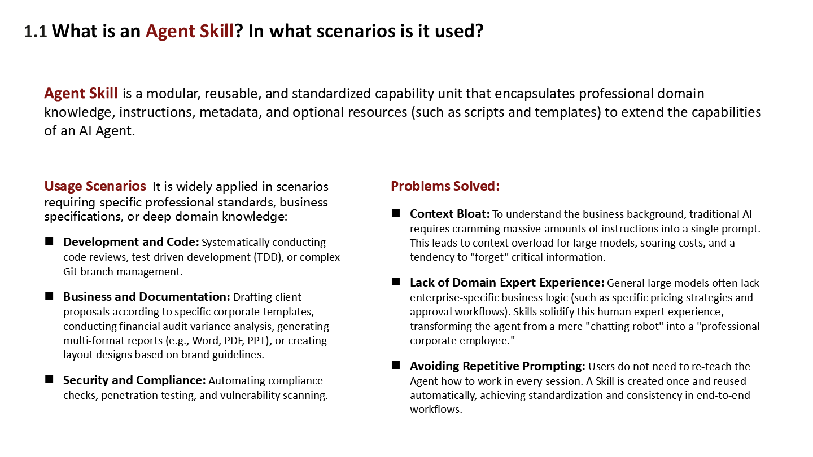

Before discussing WebSkill, we must first establish a foundational concept: What is an **Agent Skill**?

Imagine you just hired a brilliant new employee for your company (representing a general AI large model). While smart, they don't know your company's specific reimbursement processes or coding standards. To get them up to speed, you hand them an employee training manual. **An Agent Skill is exactly that—a training manual designed for AI models.**

An Agent Skill is a modular, reusable, and standardized capability unit. Within this unit, we encapsulate professional domain knowledge, explicit instructions, metadata, and even specific scripts and templates. It serves a single purpose: to expand the capabilities and boundaries of an AI agent, transforming it from a mere chatbot into a professional corporate employee.

Where are Agent Skills used? Anywhere that requires professional standards, business rules, or deep domain knowledge. Let's look at a few examples:

- **Development & Coding:** You can package code review guidelines into a Skill. This ensures the AI doesn't give random advice but strictly reviews code according to your team's standards. For instance, you could instruct it to write code following Test-Driven Development (TDD) practices or have it handle complex Git branch merges.
- **Business & Documentation:** This is a highly common scenario. When drafting a document with a corresponding Skill, the AI will strictly apply your company's fixed templates, brand colors, and typography guidelines instead of generating poorly formatted text every time. You can also have it perform variance analysis for financial audits or generate reports in multiple formats (Word, PDF, PPT) with a single click.
- **Security & Compliance:** We can convert compliance checks, penetration testing rules, and vulnerability scanning workflows into Skills, enabling the AI to execute them in an automated and standardized manner.

Why are Agent Skills so crucial? Because traditional AI faces three major pain points that Agent Skills perfectly resolve:

1.  **Solving Context Bloat:** In the past, to make AI understand your business, you had to cram dozens of pages of background information into the prompt. This not only causes context overload and skyrocketing API costs but also leads to AI hallucinations and the forgetting of key information. With Agent Skills, the AI only reads specific skill packages when needed, significantly reducing the context burden.
2.  **Bridging the Domain Expertise Gap:** No matter how smart a general model is, it doesn't intuitively know your company's pricing strategies or approval workflows. Agent Skills solidify human expert knowledge, turning a general model into a specialized one.
3.  **Eliminating Repetitive Prompting:** Without Agent Skills, you have to copy and paste the same prompts every time you want the AI to perform a task. With them, prompts are created once and reused infinitely, truly achieving workflow automation, standardization, and behavioral consistency.

---

### [Slide 1.2: What is a WebSkill? What are its unique features?]

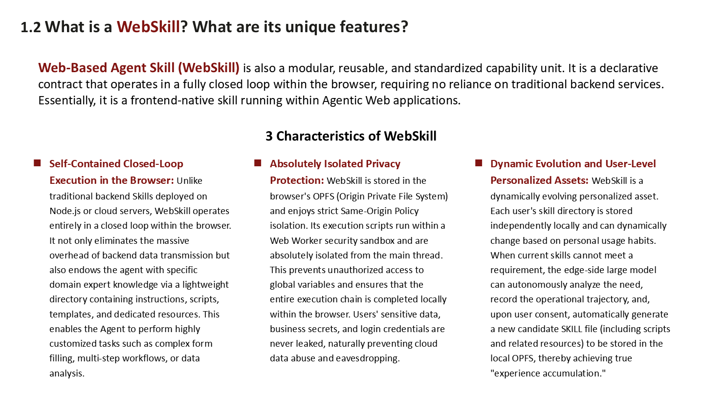

Simply put, WebSkill is a **frontend-native skill running directly in the browser**. It is a declarative contract, and its most unique aspect is that it **operates entirely within a closed loop in the browser**, without relying on traditional backend services. WebSkill differs from traditional Agent Skills in three key ways:

**1. Browser-Based Self-Contained Loop**
Traditional Skills are usually deployed on Node.js or cloud servers. WebSkill breaks this rule by completing the entire workflow directly in the browser. This means we eliminate the massive data transmission overhead between the frontend and backend. Furthermore, through a lightweight directory (containing instructions, scripts, and templates), it directly grants Agent expert capabilities on the frontend. Tasks like filling out complex forms, running multi-step workflows, or performing enterprise data analysis can all be completed locally on the user's machine.

**2. Absolute Privacy and Isolation**
This is extremely important for enterprises. WebSkill files are stored in the browser's OPFS (Origin Private File System). Unlike LocalStorage, OPFS has nearly unlimited capacity (generally limited only by the user's local storage space) and enforces stricter same-origin policy isolation. Moreover, WebSkill scripts run in a Web Worker security sandbox, completely isolated from the browser's main thread. Therefore, WebSkill scripts cannot overstep permissions to access global variables of the main Web application. Consequently, users' sensitive data, login credentials, and corporate trade secrets remain locally stored from start to finish (assuming an on-device model is used), inherently eliminating the risk of cloud data abuse or interception.

**3. Dynamic Evolution and User-Level Personalized Assets**
Traditional backend skills are rigid and shared uniformly across all users. WebSkill, however, is a living entity. It is your personal, private asset stored locally, growing and evolving based on your usage habits. If the current skill cannot complete your task, the on-device model can proactively analyze your needs, record your operation steps, and—with your consent—automatically write a new SKILL file to your local storage. As a result, Web applications adopting WebSkill technology become increasingly attuned to you over time. This is the true experience accumulation we want from AI Agents.

---

### [Slide 1.3: LLM-Centric Web AI Architecture]

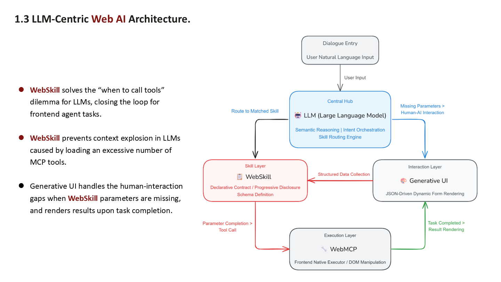

Here is an explanation of this Web AI architecture:

- At the very top is the **Conversational Input**, where the user inputs their request via the AI chat interface.
- The user's input flows to the **Central Hub**—the on-device Large Language Model (LLM). It is responsible for thinking, reasoning, and skill scheduling (i.e., routing and matching skills).
- When the LLM decides on a course of action, it connects to the **Skill Layer (WebSkill)** on the left. This layer contains the declarative Skill contract and the Schema (parameter specifications) mentioned earlier. The LLM reviews the Skill's content to determine the prerequisites for executing the task.
- If the LLM detects missing information from the user, it connects to the **Interaction Layer (Generative UI)** on the right. The Generative UI dynamically renders an interactive form on the frontend based on the missing parameters, prompting the user for data.
- Once the parameters are complete, the system moves to the **Execution Layer (WebMCP)** below. This is the frontend-native executor responsible for directly manipulating page DOM nodes or sending backend service requests. The MCP tools shoulder the actual workload.
- After the task is completed, the resulting data returns to the Generative UI on the right, transforming raw data into visual charts for the user.

In this architecture, WebSkill first solves the challenge of the model not knowing when to call which tool, thoroughly closing the loop for frontend Agent tasks. Secondly, it prevents context explosion caused by feeding the descriptions of hundreds of WebMCP tools to the model all at once. Lastly, the Generative UI elegantly bridges the human-computer interaction gap when the AI needs to request information from the user during execution.

---

### [Slide 1.4: WebSkill vs. Traditional Backend Skills]

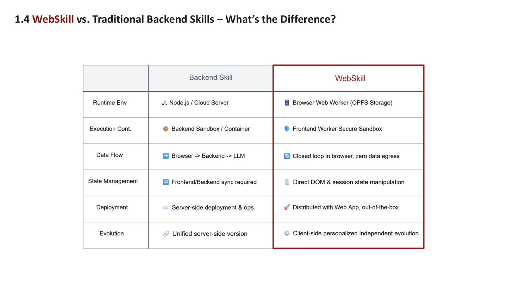

Here is a comparison between traditional backend Skills and WebSkill:

- **Runtime Environment:** Traditional Skills run on Node.js or cloud servers; WebSkill runs in the browser's Web Worker and leverages OPFS for storage.
- **Execution Carrier:** Traditional Skills rely on container sandboxes; WebSkill utilizes the frontend Worker's native security sandbox.
- **Data Flow:** The traditional approach sends browser data over the internet to the backend, which then passes it to the LLM. WebSkill operates in a closed loop entirely within the browser, with zero outward data transmission, making it both faster and more secure.
- **State Management:** Traditional Skills decouple the frontend and backend, requiring extensive code to synchronize state. WebSkill operates directly on the frontend, allowing it to manipulate the DOM and instantly access current session states.
- **Deployment:** Traditional Skills must be deployed on servers and require dedicated maintenance. WebSkill is distributed alongside the Web application—open the webpage and it's ready to use.
- **Evolutionary Capability:** When a server version of a traditional Skill is updated, it changes for everyone, making it very rigid. WebSkill is an asset on the user's local device; each person's skills can be distinct, enabling genuine, independent, and personalized evolution.

---

### [Slide 1.5: WebSkill's Unique Feature: A Privacy-First, Sandboxed Agent Loop]

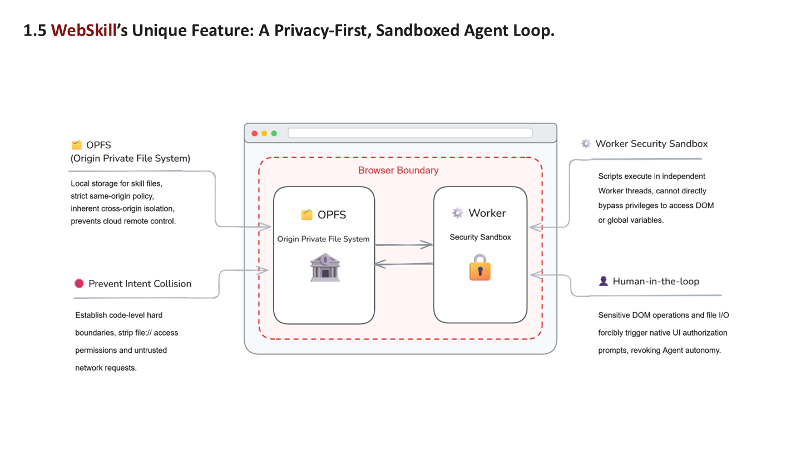

Within the browser, we rely on two main security and privacy infrastructures: OPFS and Workers:

- **OPFS (Origin Private File System)** acts like a private safe within the browser. Skill files stored here are strictly protected by the same-origin policy, rendering them untouchable by other websites and inherently guarding against malicious remote control from the cloud.
- **Preventing Intent Collision:** What is intent collision? When an AI reads a malicious operational description in a `Skill.md` file, it might be misled into performing destructive actions, such as reading, modifying, or deleting local files. OPFS establishes a security boundary at the code level, stripping away sensitive access rights like local `file://` protocols and blocking all unauthorized network requests.
- **Worker Security Sandbox:** WebSkill's scripts can only run within this independent thread. They cannot overstep their bounds to directly access the DOM in the main Web thread or retrieve global variables on the page.
- **Human-in-the-Loop:** For any operation involving sensitive DOM manipulations or file read/writes, the system is mandated to trigger a native UI authorization popup—meaning human consent via a click is required. Humans remain in the loop at all times to appropriately limit the Agent's autonomy.

---

### [Slide 2.1: WebSkill implements the Agent Skills Protocol in TypeScript]

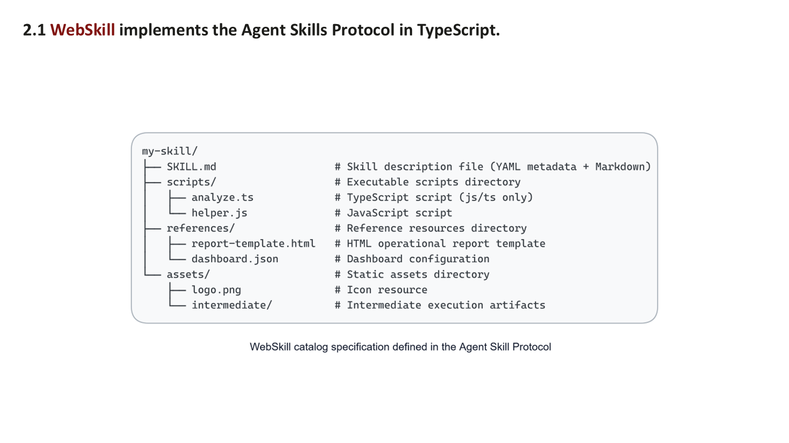

WebSkill is implemented strictly in accordance with the standard Agent Skills protocol using TypeScript. The directory structure is as follows:

- First is the **`SKILL.md`** file in the root directory. This is the core of the entire skill, containing YAML-formatted metadata (telling the LLM who it is) and Markdown-formatted instructions (telling the LLM what to do).
- Next is the **`scripts/`** directory. This houses the actual executable script code. Since we are in a Web environment, it only supports `.ts` and `.js` scripts.
- Then comes the **`references/`** directory, which stores the resources required during execution. Examples include `report-template.html` (an HTML report template) or `dashboard.json` (configuration data for an analytics dashboard).
- Finally, there is the **`assets/`** directory. This holds static resources like `logo.png` icons, as well as intermediate outputs generated by the Agent during execution (placed in `intermediate/`).

---

### [Slide 2.2: WebSkill supports the progressive disclosure of its available skills]

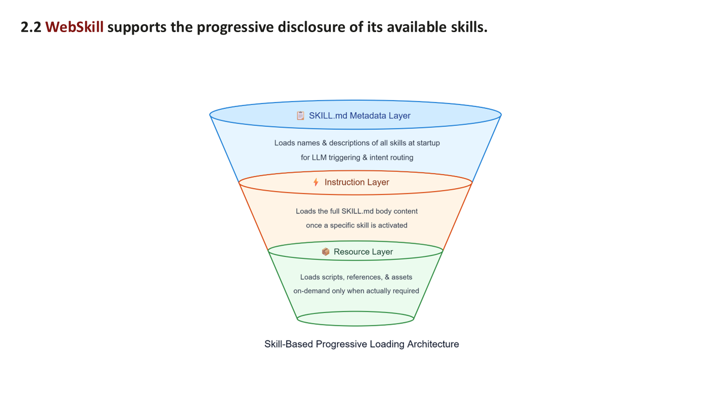

WebSkill also supports a key feature of traditional Skills: **Progressive Disclosure**. If you feed all skill descriptions, script codes, and template contents to the LLM at once, the context window will explode instantly. Progressive disclosure is designed to solve this exact problem. Its architecture is divided into three layers:

1.  **Top Layer: SKILL.md Metadata.** When a task first starts, the LLM only loads the `name` and `description` of all available skills. Much like browsing a table of contents, the LLM learns what skills are currently at its disposal.
2.  **Middle Layer: Instruction Layer.** When the LLM selects a specific skill to complete a task based on the user's need, it will then load the full body content of that `SKILL.md` into its context.
3.  **Bottom Layer: Resource Layer.** Only when the skill needs to execute its scripts or read its resources will the system load the files from the `scripts`, `references`, or `assets` directories.

This is essentially on-demand loading. Compared to strategies that load all skill descriptions or all MCP tool descriptions upfront, this layered loading approach significantly reduces context length, minimizes Token consumption, and accelerates LLM response times.

---

### [Slide 2.3: Execution Units of WebSkill: scripts/ Files]

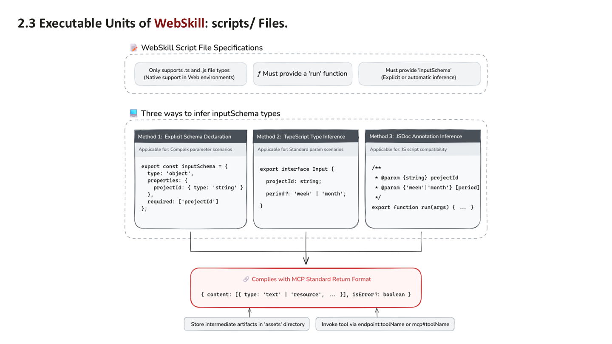

Let's dive deeper into the script file specifications within the `scripts` directory. We enforce three strict conditions here:

1.  Only **`.ts`** and **`.js`** file types, natively supported by the Web, are allowed.
2.  The code must export an execution function named **`run`**.
3.  It must provide an **`inputSchema`**, informing the AI what parameters are required to call the `run` function.

To alleviate the burden on developers, we support providing the `inputSchema` in three ways:

- **Method 1: Explicit Schema Declaration.** Suitable for complex scenarios, this involves writing a standard JSON Schema object.
- **Method 2: TypeScript Type Inference.** By simply writing a standard TypeScript `interface`, the system automatically infers the Schema.
- **Method 3: JSDoc Annotation Inference.** By adding JSDoc comments above the function to describe the parameter types, standard JavaScript files can also have their Schema inferred.

After the script finishes executing, the return value must strictly adhere to the **MCP standard format** (including a `content` array, etc.). This ensures output format consistency with other MCP tool calls and makes it easier to encapsulate unified operations later, such as saving output results to the assets directory.

The MCP tools mentioned here come in two types: one uses the standard MCP TypeScript SDK, and the other uses Google's experimental Chrome MCP API, `navigator.modelContext`. We differentiate them using `endpoint:toolName` and `mcp#toolName`, respectively. Here are the code examples:

```ts
import { McpServer } from '@modelcontextprotocol/server';
import { Client } from '@modelcontextprotocol/sdk/client/index.js';
import { MessageChannelServerTransport, MessageChannelClientTransport } from './channel.ts';
import * as z from 'zod/v4';

const server = new McpServer({ name: 'greeting-server', version: '1.0.0' });

server.registerTool({
  'greet',
  {
    description: 'Greet someone by name',
    inputSchema: z.object({ name: z.string() }),
    async ({ name }) => {
    content: [{ type: 'text', text: `Hello, ${name}!` }],
    },
  },
});

const serverTransport = new MessageChannelServerTransport('endpoint');
const clientTransport = new MessageChannelClientTransport('endpoint');
const client = new Client({ name: 'greeting-client', version: '1.0.0' });

await serverTransport.listen();
await server.connect(serverTransport);
await client.connect(clientTransport);

const result = await client.listTools();
const response = await client.callTool({ name: 'greet', arguments: { name: 'Jack' } });
```

The above shows the MCP Server and Client defined by the standard MCP TypeScript SDK. In the `Skill.md` document, `endpoint:toolName` is used to declare calling this tool. Below is the experimental Chrome MCP API, where `navigator.modelContext` acts as the MCP Server, and `navigator.modelContextTesting` acts as the MCP Client. In the `Skill.md` document, `mcp#toolName` is used:

```ts
const controller = new AbortController();

navigator.modelContext.registerTool({
  name: 'fetch_page_summary',
  description: 'Fetches the title and a partial body summary of the current page for content analysis.',
  inputSchema: {
    type: 'object',
    properties: {
      maxLength: { type: 'integer', description: 'Maximum number of characters for the returned summary', default: 100 }
    }
  },
  execute: async ({ maxLength }) => {
    const title = document.title;
    const bodyText = document.body.innerHTML.slice(0, maxLength);

    return {
      content: [{ type: 'text', text: `Title: ${title}\nSummary: ${bodyText}` }]
    };
  }
});

const availableTools = await navigator.modelContextTesting.listTools();
console.log('Registered WebMCP tools on the current page:', availableTools);

const targetTool = 'fetch_page_summary';
const toolArguments = JSON.stringify({ maxLength: 150 });
const response = await navigator.modelContextTesting.executeTool(targetTool, toolArguments);
```

---

### [Slide 2.4: Dynamic Exposure of Page-Level WebSkills via the Standard MCP Protocol]

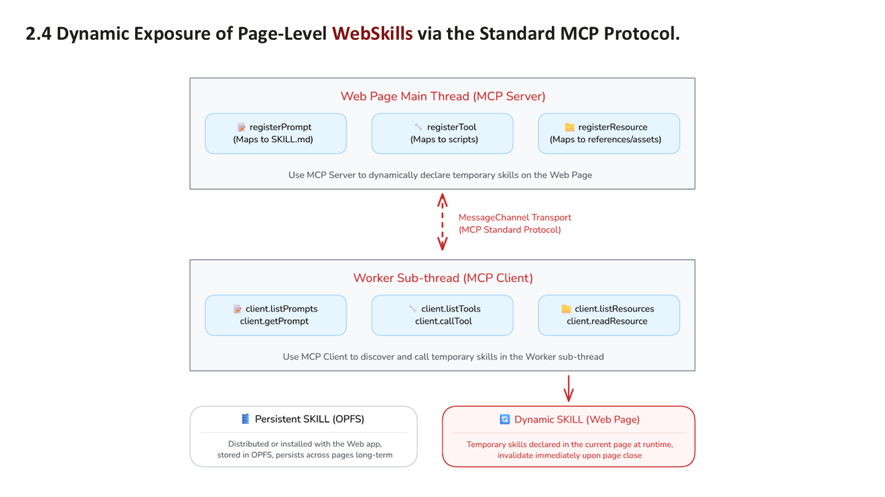

Everything discussed so far applies to **persistent skills** stored in OPFS. When the number of such skills grows large, even progressive disclosure might fail to prevent context explosion. This is when we introduce **dynamic page-level skills**. For example, when a user opens a specific product detail page, the AI temporarily gains a skill to check the current product's inventory. When the page is closed or navigated away from, this skill automatically expires. Page-level dynamic skills are declared per page, meaning the number of skills active at any one time is highly controllable. Thus, it is superior to the progressive disclosure approach for mitigating context explosion.

How do we implement page-level dynamic skills? We utilize the standard MCP protocol:

- First, we make the **Web page main thread** act as the **MCP Server**. Using the standard MCP TypeScript SDK in the Web page, we register the contents of the `SKILL.md` instructions via the `registerPrompt` method, the skill's scripts via `registerTool`, and various page resources (mapping to the skill's references/assets directory) via `registerResource`.
- Next, we build a **MessageChannel Transport** via the standard MCP transmission protocol to facilitate communication between the Web page main thread and the Worker sub-thread.
- In the **Worker sub-thread**, we also use the standard MCP TypeScript SDK to create an **MCP Client**. It discovers the skills declared by the main thread using methods like `client.listTools` and executes them using `client.callTool`.

When the user closes the Web page, these dynamic skills vanish instantly along with the page's destruction. We are effectively inventing a method to make Web applications intelligent page by page. The potential here is massive, and it's easy to envision practical applications for both B2B and B2C scenarios.

---

### [Slide 2.5: Generative UI closed the loop on human-machine interaction during WebSkills execution]

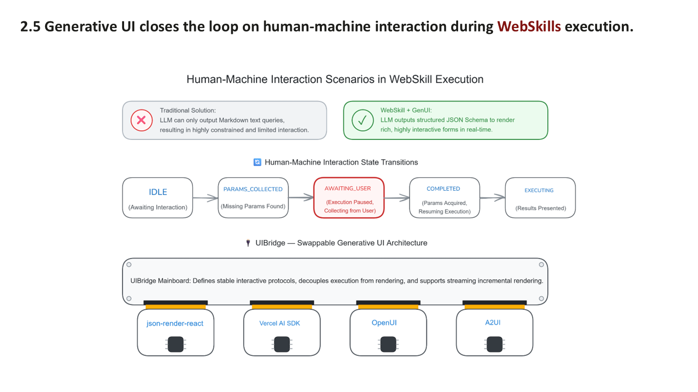

Let's look at how **Generative UI** provides the final piece of the puzzle for human-computer interaction (HCI) in the WebSkill workflow. In traditional setups, if the LLM realizes it lacks parameters to call a WebMCP tool (e.g., wanting to check an order but missing the order number), it can only output a markdown text string asking, "What is your order number?" The user then replies with text. This experience is far from optimal.

In the **WebSkill + Generative UI** architecture, when the LLM detects missing parameters during execution, it directly outputs a structured JSON Schema. The Generative UI renderer takes this JSON and instantly renders an interactive form (complete with input fields and dropdowns) inside the AI chat interface. The complete WebSkill execution flow looks like this:

The WebSkill starts in an **IDLE** state. Upon receiving a task and finding missing parameters, it transitions to **PARAMS_COLLECTED**. The system then triggers **AWAITING_USER** (pausing execution to wait for the user to fill out the form). Once the user submits the form, the system moves to **COMPLETED**, resumes **EXECUTING**, and finally presents the results.

We've designed a **UIBridge** within the WebSkill architecture. It defines the interaction protocol, meaning it doesn't matter what UI framework renders the form—whether it's `json-render-react`, `Vercel AI SDK`, `OpenUI`, or `A2UI`. Any of them can plug into the UIBridge as an adapter, entirely decoupling the WebSkill runtime from the Generative UI framework.

---

### [Slide 3.1 & 3.2: Web IDL Basic Definition and Return Value Validation]

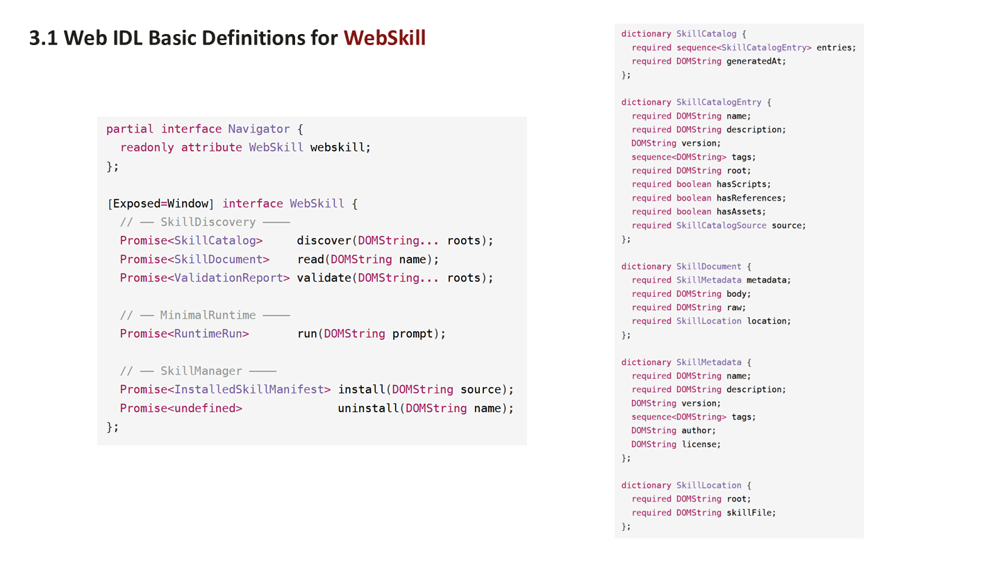

Beyond just building the WebSkill runtime framework, we aim to push it toward Web standardization. Below is our drafted **Web IDL (Interface Definition Language)** for WebSkill, proposing the addition of a native, read-only property to the browser's `Navigator` object: `navigator.webskill`.

The APIs for this webskill property fall into three major categories:

1.  **SkillDiscovery:** Provides `discover` (find skills in a directory), `read` (read skill content), and `validate` (check compliance).
2.  **MinimalRuntime:** Provides a minimalistic `run(prompt)` method that accepts natural language directly from the user and returns a `RuntimeRun` object to track execution status.
3.  **SkillManager:** Provides `install` (install new skills) and `uninstall` (remove skills) capabilities.

Simultaneously, we defined data structure dictionaries such as `SkillCatalog`, `SkillDocument`, and `SkillMetadata`. If a `SKILL.md` is incorrectly formatted or missing files, the `ValidationReport` clearly identifies the issues.

---

### [Slide 3.3: WebSkill Usage Examples]

Using WebSkill in a Web application requires just a few lines of code:

```ts
const ws = navigator.webskills;

// discover → SkillCatalog
const catalog = await ws.discover('/skills');
for (const e of catalog.entries) {
  console.log(e.name, e.hasScripts);
}

// read → SkillDocument
const doc = await ws.read('calculator');
console.log(doc.metadata.description, doc.body);

// validate → ValidationReport
const report = await ws.validate('/skills');
if (!report.ok) report.issues.forEach((i) => console.warn(i));

// run → RuntimeRun
const run = await ws.run('Use calculator to compute 2+3');
console.log(run.status, run.trace.length);

// install → InstalledSkillManifest
const m = await ws.install('https://github.com/me/skills.git');
console.log(m.name, m.installedAt, m.integrity.digest);

// uninstall → void
await ws.uninstall('calculator');
```

Here is a breakdown of the code. First, export the `webskill` object from `navigator`:

```javascript
const ws = navigator.webskill;
```

To see currently available skills:

```javascript
const catalog = await ws.discover('/skills');
```

To read a specific `calculator` skill:

```javascript
const doc = await ws.read('calculator');
```

To check if a skill has any errors:

```javascript
const report = await ws.validate('/skills');
```

To put a skill to work immediately:

```javascript
const run = await ws.run('Use calculator to compute 2+3');
```

It really is that simple! The WebSkill runtime framework automatically handles intent parsing, routing matching, and sandboxed script execution.

If you want to dynamically install a new skill from a Github repository:

```javascript
const m = await ws.install('https://github.com/me/skills.git');
```

A single command pulls the skill package, verifies its integrity, and stores it in OPFS, without needing any backend services.

---

### [Conclusion & Outlook]

Currently, the WebSkill concept is still in its infancy, but its technical value is undeniably clear. First, it completely resolves the context bloat dilemma of large models. Second, it achieves a truly isolated and secure privacy loop via OPFS and Worker sandboxes. Finally, it transforms Agent capabilities into a lightweight, dynamically distributable, and highly personalized SaaS (Skill as a Service). We believe the future of Web AI isn't just about Agents manipulating Web pages; it's about the browser itself becoming an intelligent runtime environment equipped with various Agent skills.

We have built a website for WebSkill at https://webskill.ai . To give everyone a more intuitive feel, the site features a Live Demo (https://webskill.ai/demo). Although this Demo is purely static and doesn't involve real AI execution, it perfectly illustrates the concepts and features of WebSkill. We look forward to your feedback. Thank you!


