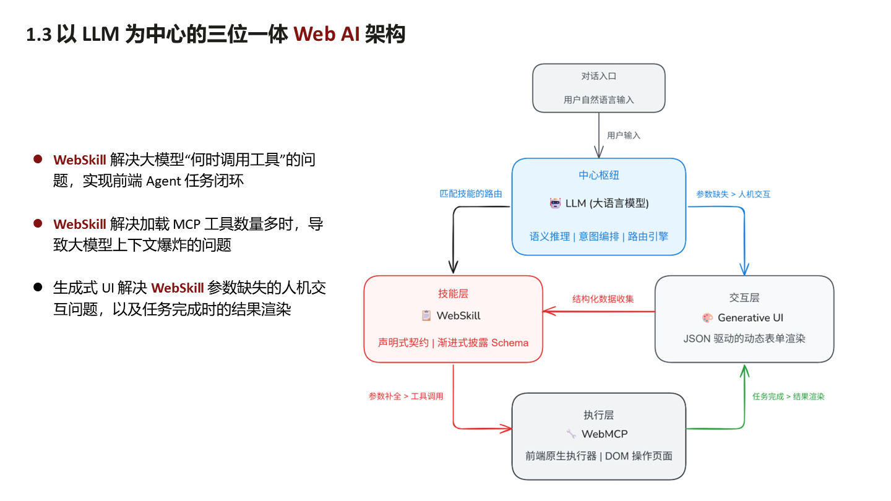
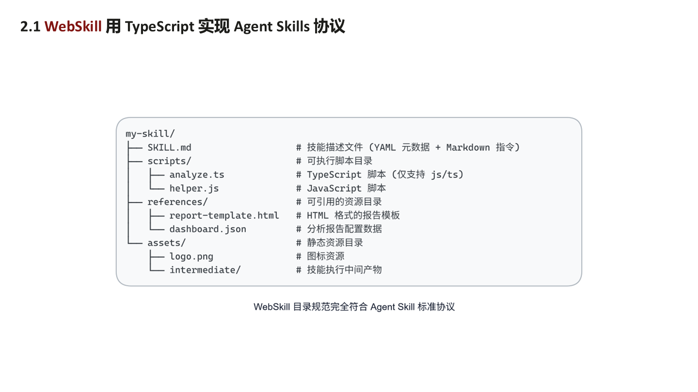
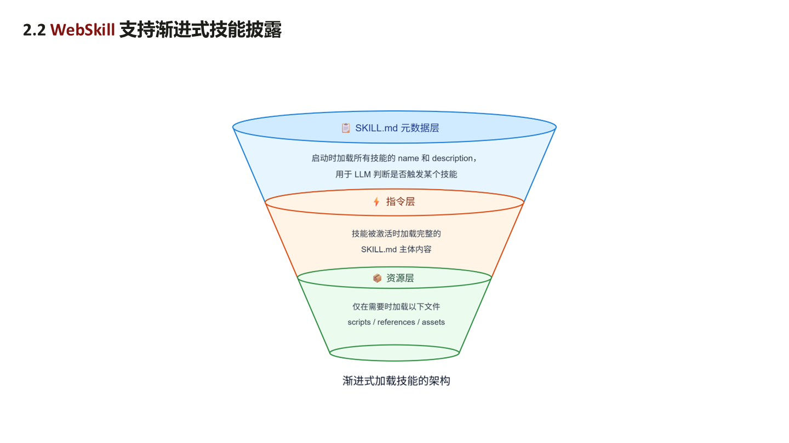
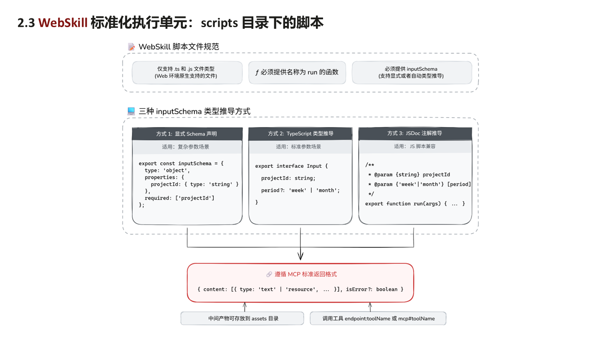

# WebSkill - Agentic Web 面向 SaaS (Skill as a Service) 的进化

草案提案，2026 年 7 月

**作者:** Chunhui Mo (Huawei)

**翻译:** [英文](https://github.com/kevinmoch/web-skill/blob/main/README.md)

本文是基于 **《WebSkill - Agentic Web 面向 SaaS 的进化》** 的解说稿。这里的 SaaS，不是我们常说的软件即服务（Software as a Service），而是**Skill as a Service**，也就是**技能即服务**。

本文分三个部分来讲解这个 WebSkill：首先，我们花点时间弄清楚 WebSkill 到底是什么？它能带来什么价值？接着看它的底层基础能力和核心特性到底是怎么运作的，最后是将它推向 Web 标准化的一些建议。

---

### 【第 1.1 页：Agent Skill 是什么？在什么场景下使用？】


在聊 WebSkill 之前，我们必须先理清楚一个基础概念：什么是 **Agent Skill（智能体技能）**？

假设你为公司招聘了一位聪明的新员工（通用 AI 大模型）。他虽然聪明，但是他不懂你们公司的具体报销流程，不懂你们的代码规范。这时你需要给他一本员工培训手册，**Agent Skill，就是给 AI 大模型看的培训手册**。

Agent Skill 是一个模块化的、可以反复使用的标准化能力单元。在这个能力单元里，我们封装了专业的领域知识、明确的指令、元数据，还包括一些脚本和模板。它的目的只有一个：扩展 AI 智能体的能力与边界，让它从一个懂聊天的机器人，变成一个专业的企业员工。

Agent Skill 在哪些场景下使用？需要专业标准、业务规范或深度领域知识的地方都可以使用。我们来看几个例子：

- **开发与代码：** 比如，可以把代码审查的规范做成一个 Skill。这样 AI 就不会乱给建议，而是严格按照团队的规范来审查。比如，让它按照测试驱动开发（TDD）的流程来写代码，让它帮你处理非常复杂的 Git 分支合并。
- **业务与文档：** 这种场景非常普遍。比如，当你去写一份文档，如果有相应的 Skill，AI 就会严格套用公司的固定模板、品牌配色和排版指南，而不是每次都生成一份乱七八糟格式的文档。我们还可以让它做财务审计的差异分析，或者一键生成 Word、PDF、PPT 等多种格式的报告。
- **安全与合规：** 我们可以把合规性检查、渗透测试规则、漏洞扫描的流程做成 Skill，让 AI 自动化、标准化地去执行。

为什么 Agent Skill 这么重要？因为传统的 AI 存在三个痛点，而 Agent Skill 完美地解决了这些痛点：

1.  **解决上下文臃肿：** 过去为了让 AI 懂业务，你不得不把几十页的背景资料全都塞进提示词，这不仅导致大模型上下文过载、API 成本飙升，还会让 AI 产生幻觉，遗忘关键信息。有了 Agent Skill，AI 只需要在用到时读取特定的技能包内容，这样上下文的负担就大大减轻。
2.  **补齐了领域专家经验：** 当前通用的大模型再聪明，也不知道你公司的定价策略、审批流程等等。Agent Skill 就是把这些人类专家的经验固化下来，让通用的大模型变成专业的大模型。
3.  **避免了重复提示：** 没有 Agent Skill 的时候，你每次都需要复制粘贴同样的提示词来教 AI 做事情。有了 Agent Skill 提示词一次创建终身复用，真正实现工作流的自动化、标准化以及行动一致性。

---

### 【第 1.2 页：WebSkill 是什么？有哪些独特的地方？】


简单的说，WebSkill 就是**运行在浏览器里的前端原生技能**。它是一个声明式的契约，最独特的地方在于：它**完全在浏览器端闭环运行**，不依赖传统的后端服务。WebSkill 有三个与传统 Agent Skill 不同的地方：

**一、浏览器端自闭环运行**
传统的 Skill 一般都部署在 Node.js 或者云端服务器上。WebSkill 打破了这个规则，它直接在浏览器里完成整个工作闭环。这意味着我们干掉了前后端之间庞大的数据传输开销。此外，它通过一个轻量的目录（包含指令、脚本、模板），直接在前端赋予 Agent 专家的能力。比如，填一个复杂的表单，跑一个多步骤的工作流，做企业数据分析等等，都可以在用户本地完成。

**二、绝对隔离的隐私保护**
这点对于企业来说非常重要，WebSkill 的文件存储在浏览器的 OPFS（源私有文件系统）里，OPFS 不同于 LocalStorage，容量近乎无限（一般只受用户本地存储空间的容量限制），其次比 LocalStorage 有更严格的同源策略隔离。而且 WebSkill 的脚本是在 Web Worker 安全沙箱里运行，跟浏览器主线程绝对隔离，所以 WebSkill 的脚本无法越权访问 Web 主线程应用的全局变量。因此，用户的敏感数据、登录凭证、企业的商业机密自始至终都在用户本地，没有外泄（假设使用端侧大模型），天然杜绝云端数据被滥用、被监听的风险。

**三、动态演进与用户级个性化资产**
传统的后端技能是所有用户共用一套死板的技能。WebSkill 是活的。它是你个人的私有资产，它存储在你的本地，会根据你的使用习惯不断成长演进。如果发现当前的技能不能完成你的任务，端侧大模型可以主动分析你的需求，记录你的操作步骤，然后在经过你同意的情况下，自动写一个新的 SKILL 文件存储到本地，于是采用 WebSkill 技术的 Web 应用会随着你的使用变得越来越懂你，这才是我们想要的Agent 智能体的经验积累。

---

### 【第 1.3 页：以 LLM 为中心的三位一体 Web AI 架构】



以下是对这个 Web AI 架构的解释：

- 最上面是**对话入口**，也就是 AI 对话框中用户输入需求的地方。
- 用户输入的信息会流向**中心枢纽**——也就是端侧大模型（LLM）。它负责思考和推理，负责技能调度（即技能的路由匹配）。
- 当 LLM 决定要怎么做时，它会连接到左边的**技能层（WebSkill）**。这里面包含了 Skill 声明式契约，以及我们前面提到的 Schema（也就是参数规范）。LLM 会查阅 Skill 的内容，看执行这个任务需要什么条件。
- 如果 LLM 发现用户提供的信息有缺失，它就会连接到右边的**交互层（Generative UI）**。生成式 UI 会根据缺失的参数，在前端动态画出一个可交互的表单，然后系统去找用户要数据。
- 当参数补全后，系统就会进入下方的**执行层（WebMCP）**，这是前端原生的执行器，负责直接去操作页面的 DOM 节点，或者向后端发送服务请求等，即 MCP 工具承担干活的重任。
- 任务完成后，结果数据又会回到右边的 Generative UI，把枯燥的数据变成图表渲染给用户看。

在这个架构中，WebSkill 首先解决大模型不知道什么时候该调什么工具的难题，把前端 Agent 的任务彻底闭环。其次，它避免把成百上千个 WebMCP 工具的描述一次性塞给大模型导致的上下文爆炸。最后，生成式 UI 又优雅地解决了 WebSkill 执行过程中 AI 向人类索要信息时人机交互的断层问题。

---

### 【第 1.4 页：WebSkill 与传统后端 Skill 的不同点】


以下是传统后端 Skill 跟 WebSkill 的对比：

- **运行环境：** 传统 Skill 运行在 Node.js 或云服务器上；WebSkill 运行在浏览器的 Web Worker，并利用 OPFS 存储。
- **执行载体：** 传统 Skill 依赖容器沙箱；WebSkill 则利用前端 Worker 自带的安全沙箱。
- **数据流向：** 传统 Skill 的做法是：浏览器的数据先通过互联网发送到后端，后端再传给 LLM；WebSkill 直接在浏览器内闭环，零数据传出，既快又安全。
- **状态管理：** 传统 Skill 的前后端是分离的，需要你写一堆代码去同步前后端的状态；WebSkill 就在前端，可以直接操作 DOM，获取当前会话状态。
- **部署方式：** 传统 Skill 需要部署到服务器，还需要专人运维；WebSkill 是跟着 Web 应用一起分发给用户，打开网页就能用，真正做到即开即用。
- **演进能力：** 传统 Skill 的服务器版本，一更新所有人的技能都得跟着变，非常死板；WebSkill 是用户端侧的资产，每个人的 Skill 都可以不一样，实现真正的个性化独立演进。

---

### 【第 1.5 页：WebSkill 的独特优势：绝对隔离的隐私 Agent 闭环】


在浏览器里，我们有两个主要的安全隐私保护设施：OPFS 和 Worker：

- **OPFS（源私有文件系统）** 就像是浏览器里的私人保险箱，技能文件存在这里受到严格的同源策略保护，别的网站无法触碰，天然防范任何云端的、远程的恶意遥控。
- **防范意图碰撞：** 什么是意图碰撞？当 AI 读取 Skill.md 技能文档上恶意操作的描述文字，就会被误导去干一些破坏安全的事，比如读取、修改、删除本地文件等。OPFS 在代码级别建立了安全边界，剥离了本地 `file://` 等敏感访问权限，阻断所有非授权的网络请求。
- **Worker 安全沙箱：** WebSkill 的技能脚本只能在这个独立线程里运行，无法越权去直接访问 Web 主线程里的 DOM 或者获取页面上的全局变量等。
- **人类在环（Human-in-the-loop）** 任何涉及敏感的 DOM 操作或文件读写，系统要求触发一个原生的 UI 授权弹窗，也就是必须经过人的点击同意。人始终在环里，必须降低 Agent 的自治权。

---

### 【第 2.1 页：WebSkill 用 TypeScript 实现 Agent Skills 协议】



WebSkill 是严格按照标准的 Agent Skills 协议用 TypeScript 来实现，以下是 WebSkill 的目录结构：

- 首先是根目录下的 **`SKILL.md`** 文件。这是整个技能的核心，包括 YAML 格式的元数据（告诉大模型我是谁），以及 Markdown 格式的指令（告诉大模型怎么做）。
- 然后是 **`scripts/`** 目录。这里放的是具体干活的脚本代码，因为我们是在 Web 环境，所以它只支持 `.ts` 和 `.js` 脚本。
- 接着是 **`references/`** 目录。这里放的是干活时所需的资源。比如 `report-template.html`（HTML 格式的报告模板），或者 `dashboard.json`（分析看板的配置数据）等。
- 最后是 **`assets/`** 目录。这里放的是一些静态资源，比如 `logo.png` 图标等。也包括存储 Agent 在执行过程中产生的一些中间产物（放在 `intermediate/`）。

---

### 【第 2.2 页：WebSkill 支持渐进式技能披露】



WebSkill 同样支持传统 Skill 的特性：**渐进式技能披露（Progressive Disclosure）**。如果把所有的技能描述、脚本代码、模板内容全部塞给 LLM，那么上下文会瞬间爆炸，渐进式技能披露就是用来解决这个问题。它的架构分为三层：

1.  **顶层：SKILL.md 元数据** 在任务刚启动时，LLM 只加载所有技能的 `name`（名字）和 `description`（描述）。LLM 就像看目录一样，了解当前可以使用哪些技能。
2.  **中间层：指令层** 当 LLM 根据用户需求选择一项技能来完成任务时，才会去把完整的 `SKILL.md` 主体内容加载到上下文。
3.  **最底层：资源层** 只有这项技能需要执行其中的脚本，或者需要读取该技能的资源，系统才会去加载 `scripts` 或 `references`、`assets`里的文件。

其实这就是按需加载，对比那种加载全部技能的描述，或者全部 MCP 工具描述的方案，这种分层加载降低了上下文的长度，减少了 Token 消耗，提高了 LLM 的响应速度。

---

### 【第 2.3 页：WebSkill 标准化执行单元：scripts 目录下的脚本】



接下来我们深入看一下 `scripts` 目录下的脚本文件规范，这里定义三个硬性条件：

1. 只允许 Web 原生支持的 **`.ts`** 和 **`.js`** 文件类型。
2. 代码里必须导出一个名字叫 **`run`** 的运行函数。
3. 必须提供 **`inputSchema`**，也就是告诉 AI 调用 run 函数需要传什么参数。

为了减轻开发者的负担，我们支持以下三种方式提供 `inputSchema`：

- **方式 1：显式 Schema 声明** 适合复杂的场景，即写一段标准的 JSON Schema 对象。
- **方式 2：TypeScript 类型推导** 只要写一个标准的 TypeScript `interface`，系统会自动推导出 Schema 。
- **方式 3：JSDoc 注解推导** 只要在函数头上写好 JSDoc 注释，说明入参的类型，JavaScript 的文件同样能推导出 Schema。

脚本执行完后，返回值必须严格遵循 **MCP 标准格式**（包含 `content` 数组等），这样可以确保与其他 MCP 工具调用后的输出格式保持一致，并且更便于后续封装统一的操作，比如将输出结果保存到 assets 目录等。

这里提到的 MCP 工具包含两种类型：一种是使用标准 MCP 的 TypeScript SDK，另一种是谷歌发布的 Chrome 实验性 MCP API 即 navigator.modelContext。我们分别用 `endpoint:toolName` 和 `mcp#toolName` 来区分，代码示例如下：

```ts
import { McpServer } from '@modelcontextprotocol/server';
import { Client } from '@modelcontextprotocol/sdk/client/index.js';
import { MessageChannelServerTransport, MessageChannelClientTransport } from './channel.ts';
import * as z from 'zod/v4';

const server = new McpServer({ name: 'greeting-server', version: '1.0.0' });

server.registerTool({
  'greet',
  {
    description: 'Greet someone by name',
    inputSchema: z.object({ name: z.string() }),
    async ({ name }) => {
    content: [{ type: 'text', text: `Hello, ${name}!` }],
    },
  },
});

const serverTransport = new MessageChannelServerTransport('endpoint');
const clientTransport = new MessageChannelClientTransport('endpoint');
const client = new Client({ name: 'greeting-client', version: '1.0.0' });

await serverTransport.listen();
await server.connect(serverTransport);
await client.connect(clientTransport);

const result = await client.listTools();
const response = await client.callTool({ name: 'greet', arguments: { name: 'Jack' } });
```

以上是标准 MCP 的 TypeScript SDK 定义的 MCP Server 和 MCP Client，在 Skill.md 文档中，使用 `endpoint:toolName ` 来声明调用该工具。以下是 Chrome 实验性 MCP API，其中 `navigator.modelContext` 相当于 MCP Server，而 `navigator.modelContextTesting` 相当于 MCP Client。在 Skill.md 文档中，使用 `mcp#toolName ` 来声明调用该工具：

```ts
const controller = new AbortController();

navigator.modelContext.registerTool({
  name: 'fetch_page_summary',
  description: '获取当前页面的标题和部分正文摘要，用于分析页面内容。',
  inputSchema: {
    type: 'object',
    properties: {
      maxLength: { type: 'integer', description: '返回摘要的最大字数', default: 100 }
    }
  },
  execute: async ({ maxLength }) => {
    const title = document.title;
    const bodyText = document.body.innerHTML.slice(0, maxLength);

    return {
      content: [{ type: 'text', text: `标题: ${title}\n内容摘要: ${bodyText}` }]
    };
  }
});

const availableTools = await navigator.modelContextTesting.listTools();
console.log('当前页面已注册的 WebMCP 工具:', availableTools);

const targetTool = 'fetch_page_summary';
const toolArguments = JSON.stringify({ maxLength: 150 });
const response = await navigator.modelContextTesting.executeTool(targetTool, toolArguments);
```

---

### 【第 2.4 页：利用 MCP 标准协议动态声明页面级 WebSkill】


前面我们讲的都是存储在 OPFS 里的**持久化技能**。当这类技能的数量变多的时候，有可能渐进式技能披露也解决不了上下文爆炸的问题，此时我们就需要引入**页面动态技能**。例如，用户打开了一个特定的商品详情页，在这个页面存续期间，AI 能获得一个查询当前商品库存的技能，当页面关掉或者跳转到其他页面时，该技能就自动失效。页面动态技能是按页面级声明的，大部分情况下，一个页面的技能数量是可控的，因此它比渐进式技能披露方案更优，能缓解上下文爆炸的问题。

如何实现声明页面动态技能？我们利用标准 MCP 协议来做：

- 首先让 **Web 页面主线程** 充当 **MCP Server**。我们在 Web 页面借助标准 MCP 的 TypeScript SDK，使用 `registerPrompt` 方法注册 `SKILL.md` 指令的内容，使用 `registerTool` 方法注册 Skill 技能的 script 脚本，使用 `registerResource` 方法注册当前页面的各类资源（映射到 Skill 技能的 references / assets 目录）。
- 然后，我们通过 MCP 标准传输协议构建一个 **MessageChannel Transport** 来实现 Web 页面主线程与 Worker 子线程的通讯。
- 在 **Worker 子线程** 我们同样借助标准 MCP 的 TypeScript SDK 创建 **MCP Client**，通过 `client.listTools` 等方法发现 Web 页面主线程声明的 Skill 技能，然后使用 `client.callTool` 等方法去调用。

当用户关闭该 Web 页面时，这些动态技能就会随着页面的销毁而立刻消失。我们这是在发明了一种让 Web 应用逐个页面智能化的方法，这里想象的空间很大，无论对于 to B 还是 to C 都不难找出落地的场景。

---

### 【第 2.5 页：生成式 UI 实现 WebSkill 执行中的人机交互闭环】


我们来看 **生成式 UI (Generative UI)** 是怎么补齐 WebSkill 工作流中人机交互的最后一块拼图。在传统的方案里，如果 LLM 发现调用 WebMCP 工具少了参数（比如想查订单，但用户没又说订单号），LLM 只能输出一段 Markdown 文本询问用户：“请问您的订单号是多少？” 然后用户再用文字回复，这种体验显然不是最佳。

在 **WebSkill + 生成式 UI** 的架构里，当 WebSkill 在执行任务过程中，LLM 发现参数缺失，它会直接输出一段结构化的 JSON Schema，生成式 UI 的渲染器拿到这个 JSON，会在 AI 对话框里实时渲染出一个包含了输入框、下拉列表的交互表单。完整的 WebSkill 运行流程是这样的：

WebSkill 原本在 **IDLE（等待）**状态。接收到任务后，发现参数不足，进入 **PARAMS_COLLECTED**。此时系统会立刻触发 **AWAITING_USER**（暂停执行，等待用户填表）。用户在表单里点完提交，系统进入 **COMPLETED**，接着恢复 **EXECUTING（执行）**，最后把结果呈现出来。

我们在 WebSkill 架构里设计了 **UIBridge**。它定义交互协议，不管 AI 对话框用什么渲染 UI 交互表单，比如 `json-render-react` `Vercel AI SDK` ，或者 `OpenUI`、`A2UI`，统统可以作为适配器插到 UIBridge，使得 WebSkill 运行与生成式 UI 框架解耦。

---

### 【第 3.1 + 3.2 页：Web IDL 基础定义与校验运行返回值】


我们不仅想把 WebSkill 的运行框架做出来，也希望将其往 Web 标准化的方向迈进，以下是我们提出的 WebSkill 的 **Web IDL（接口定义语言）**草案，在浏览器的 `Navigator` 对象上，原生地增加一个只读属性：`navigator.webskill`。

这个 webskill 属性的 API 接口分为三大类：

1. **SkillDiscovery（技能发现层）** 提供 `discover` (发现目录里的技能)、`read` (读取技能内容)、`validate` (校验技能是否合规)。
2. **MinimalRuntime（最小化运行层）** 提供一个最小化的 `run(prompt)` 方法，直接把用户的自然语言传进去，返回一个 `RuntimeRun` 对象来追踪技能的执行状态。
3. **SkillManager（技能管理层）** 提供 `install` (安装新技能) 和 `uninstall` (卸载技能) 的功能。

同时，我们定义了所有的数据结构字典，比如 `SkillCatalog`（技能目录）、`SkillDocument`（技能文档）、`SkillMetadata` 等。如果写的 `SKILL.md` 格式不对，或者缺失文件，`ValidationReport` 会清楚地告诉技能的内容哪里出了问题。

---

### 【第 3.3 页：WebSkill 使用示例】

在 Web 应用里使用 WebSkill，只需要以下几行代码：

```ts
const ws = navigator.webskills;

// discover → SkillCatalog
const catalog = await ws.discover('/skills');
for (const e of catalog.entries) {
  console.log(e.name, e.hasScripts);
}

// read → SkillDocument
const doc = await ws.read('calculator');
console.log(doc.metadata.description, doc.body);

// validate → ValidationReport
const report = await ws.validate('/skills');
if (!report.ok) report.issues.forEach((i) => console.warn(i));

// run → RuntimeRun
const run = await ws.run('用 calculator 计算 2+3');
console.log(run.status, run.trace.length);

// install → InstalledSkillManifest
const m = await ws.install('https://github.com/me/skills.git');
console.log(m.name, m.installedAt, m.integrity.digest);

// uninstall → void
await ws.uninstall('calculator');
```

以下是对代码的解读，首先从 `navigator` 导出 `webskill` 对象：

```javascript
const ws = navigator.webskill;
```

想看当前有哪些技能：

```javascript
const catalog = await ws.discover('/skills');
```

想读一下具体的 `计算器` 技能：

```javascript
const doc = await ws.read('calculator');
```

检查技能有没有写错：

```javascript
const report = await ws.validate('/skills');
```

直接让技能开干：

```javascript
const run = await ws.run('用 calculator 计算 2+3');
```

就是这么简单！WebSkill 运行框架会自动完成意图解析、路由匹配和沙箱执行脚本。

如果想从 Github 仓库里动态安装一个新技能：

```javascript
const m = await ws.install('https://github.com/me/skills.git');
```

只需一条指令就能直接完成技能包的拉取、完整性校验，并存入 OPFS，不需要依赖任何后端服务。

---

### 【总结与展望】

目前 WebSkill 概念还处在萌芽阶段，但是它的技术价值已经无比明确：首先它彻底解决了大模型上下文臃肿的难题，又通过 OPFS 和 Worker 沙箱做到了真正的绝对隔离的隐私安全闭环，还把 Agent 能力变成了一个轻量级、可动态分发、且千人千面的 SaaS（技能即服务）。我们相信 Web AI 的未来，不仅仅是让 Agent 智能体操作 Web 页面，还要让浏览器本身成为一个智能的、具备各种技能的 Agent 智能体运行环境。

我们为 WebSkill 搭建了一个网站 https://webskill.ai ，为了让大家有更直观的感受，网站还提供一个 Live Demo (https://webskill.ai/demo)，虽然该 Demo 是纯静态功能演示，不涉及真正的 AI 运行，但并不妨碍大家体验 WebSkill 概念和特性，期待大家的反馈，谢谢！


