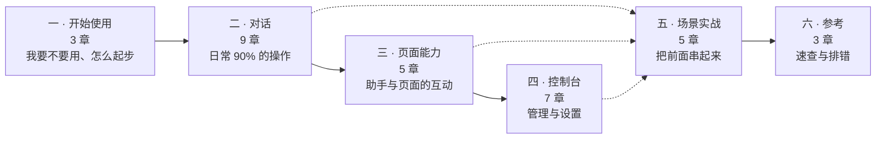
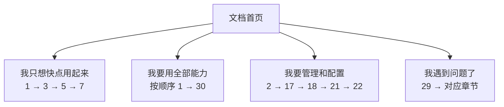

# 01 · 文档信息架构（章节树）

这是文档模块的**目录设计**，是后续所有写作的骨架。
执行者可以对它提出修订，但**必须先修订本文件再动笔**，不允许边写边改结构。

---

## 1. 顶层结构

六个部分，31 章。分部的逻辑是**用户的认知顺序**，不是产品的模块顺序：

设计要点：

- **第二部分是主干**，篇幅最重。多数读者只读到这里就够用了。
- **第三部分是分水岭**：网页版与扩展版的能力差异集中在这里。
- **第四部分按 console 自身的 6 个导航分组走**，与界面结构一一对应，
  读者在界面上看到什么分组，文档里就是哪一节，降低查找成本。
- **第五部分不引入新功能**，只把前面的能力组合成完整任务，全部基于 Demo。
- 第一部分第 2 章（形态选择）故意前置，避免读者读了半天才发现自己用的形态没这功能。

---

## 2. 完整章节表

`slug` 是站点路由与锚点用的标识，确定后不要改（外链会失效）。

### 第一部分 · 开始使用

| #   | 章标题             | slug         | 一句话目标                             |
| --- | ------------------ | ------------ | -------------------------------------- |
| 1   | 认识 WebSkill 助手 | `intro`      | 用 3 个真实例子说清它能替你做什么      |
| 2   | 网页版与扩展版     | `editions`   | 读者能判断自己在用哪个、该期待什么能力 |
| 3   | 五分钟上手         | `quickstart` | 在 Demo 里跑通第一次完整对话           |

### 第二部分 · 对话

| #   | 章标题                     | slug            | 一句话目标                                                                                            |
| --- | -------------------------- | --------------- | ----------------------------------------------------------------------------------------------------- |
| 4   | 对话界面导览               | `chat-tour`     | 认全界面上每个区域和按钮                                                                              |
| 5   | 提问、回答与打断           | `chat-basics`   | 会发消息、停止生成、重发、编辑、复制、删除                                                            |
| 6   | 管理会话                   | `sessions`      | 会新建、搜索、重命名、归档、删除、翻历史                                                              |
| 7   | 技能：让助手会干专业活     | `skills-usage`  | 理解技能是什么、怎么触发、怎么看它用了哪个，以及「现成的 / 现做的」两类技能怎么选、把这次对话存成技能 |
| 8   | 助手向你要东西：六种交互卡 | `interactions`  | 认识并正确应答 6 种卡片                                                                               |
| 9   | 会画画的回答：生成式界面   | `generative-ui` | 看懂表格/图表/表单/看板类回答并与之交互                                                               |
| 10  | 附件、图片、语音与拍照     | `attachments`   | 会传四类附件（含 Word/Excel）、传图、用语音、用摄像头                                                 |
| 11  | 看懂助手在做什么           | `transparency`  | 会读运行步进、工具调用、思考过程、任务清单                                                            |
| 12  | 选择模型                   | `models`        | 会切模型、看懂模型能力标记的含义                                                                      |

### 第三部分 · 页面能力

| #   | 章标题                               | slug               | 一句话目标                                                           |
| --- | ------------------------------------ | ------------------ | -------------------------------------------------------------------- |
| 13  | 让助手读当前页面                     | `page-perception`  | 理解读的是什么范围、哪些内容不会被读                                 |
| 14  | 让助手操作页面                       | `page-actions`     | 知道哪些操作要你点确认、会授权、会撤销、知道边界在哪                 |
| 15  | 跨标签页工作（仅扩展版）             | `tabs`             | 会让助手同时处理多个网页、逐项处理整个列表，并知道它一次最多开多少页 |
| 16  | 产物：大屏、公文、幻灯片与打印       | `artifacts`        | 会查看、放映、下载、打印助手产出的东西                               |
| 17  | 让它看你刚下载的那个文件（仅扩展版） | `downloaded-files` | 会让助手读本机下载的文件，并知道每次读取都经过了自己点头             |

### 第四部分 · 控制台

| #   | 章标题     | slug                  | 覆盖的 console 页面                                                                          |
| --- | ---------- | --------------------- | -------------------------------------------------------------------------------------------- |
| 17  | 控制台导览 | `console-tour`        | `overview` + 外壳（导航/面包屑/命令面板）                                                    |
| 18  | 技能管理   | `console-skills`      | `skills.library` `skills.editor` `skills.transfer` `skills.integrity`                        |
| 19  | 运行记录   | `console-runs`        | `runs.activity` `runs.inspector` `runs.sessions`                                             |
| 20  | 治理与复核 | `console-governance`  | `governance.review` `.audit` `.versions` `.eval` `.insights`                                 |
| 21  | 连接       | `console-connections` | `connections.models` `.mcp` `.webmcp` `.page`                                                |
| 22  | 设置       | `console-settings`    | `settings.runtime` `.sandbox` `.genui` `.prompts` `.trust` `.privacy` `.appearance` `.about` |

25 页全覆盖：1 + 4 + 3 + 5 + 4 + 8 = 25。**逐页核对，一页都不能漏。**

### 第五部分 · 场景实战（全部基于 Demo）

| #   | 章标题                         | slug                   | 用到的 Demo 素材                                                                                        |
| --- | ------------------------------ | ---------------------- | ------------------------------------------------------------------------------------------------------- |
| 23  | 生成一份敏捷运营报告           | `case-report`          | 快捷提示「生成当前项目的敏捷运营报告…」+ `agile-ops-dashboard`                                          |
| 24  | 让助手总结我正在看的页面       | `case-summarize`       | 快捷提示「读取我当前正在看的这个页面…」+ 页面感知                                                       |
| 25  | 出一份可打印的质量通报         | `case-bulletin`        | `quality-bulletin` + 打印/PDF                                                                           |
| 26  | 做一套幻灯片并放映             | `case-slides`          | `agile-slide-deck` + `viewer.html` 放映                                                                 |
| 27  | **说一句话，它替你把表填好**   | `case-fill-form`       | 快捷提示「根据我的想法规划新需求、迭代任务和测试用例，带我到各个页面逐个创建落地」+ 语音输入 + 表单动作 |
| 28  | **把一份文档里的内容录进系统** | `case-import-file`     | `public/demo/attachment/*.docx` + 快捷提示「读取…带附件的那几条需求文档…」                              |
| 29  | **把这次做过的事变成一个技能** | `case-skill-lifecycle` | 快捷提示「…把「查缺陷、读指标」这个流程固化成一个技能」+ 技能编辑器 + 复核队列                          |

> **第 28、29 章是新增的，第 30 章由原「让助手改一个技能」扩写。**
> 原因：前四个场景章全是「它给我看什么」，**缺了「它替我做什么」**，
> 而后者恰恰是新读者感知最强烈、最能建立第一印象的能力。
> 第 30 章补上了原章缺失的"技能从哪来"。

### 第六部分 · 参考

| #   | 章标题                       | slug         | 一句话目标                         |
| --- | ---------------------------- | ------------ | ---------------------------------- |
| 30  | 能力对照表：网页版 vs 扩展版 | `comparison` | 一张全表定论两种形态的差异         |
| 31  | 常见问题与排错               | `faq`        | 按症状索引的排错手册               |
| 32  | 隐私与数据去向               | `privacy`    | 说清数据到底去了哪、什么不会被发送 |

---

## 3. 特性 → 章节的映射（防漏检查表）

写完后用这张表反查：**每个源码特性域都必须有归宿**。

### chatbot 的 26 个文案域

| 文案域                    | 条数 | 归属章                         |
| ------------------------- | ---- | ------------------------------ |
| `settings.*`              | 111  | 22（console 设置）+ 12（模型） |
| `interaction.*`           | 62   | **8**（六种交互卡）            |
| `composer.*`              | 34   | 5（提问）+ 10（附件语音拍照）  |
| `session.*`               | 24   | **6**（管理会话）              |
| `message.*`               | 14   | 5（消息操作）                  |
| `surface.*`               | 14   | **9**（生成式界面）            |
| `error.*`                 | 14   | 29（排错）                     |
| `tool.*`                  | 12   | **11**（看懂助手在做什么）     |
| `trace.*`                 | 12   | 11                             |
| `welcome.*`               | 10   | 3（五分钟上手）+ 4（界面导览） |
| `header.*`                | 9    | 4（界面导览）                  |
| `run.*`                   | 8    | 11                             |
| `status.*`                | 8    | 11                             |
| `todo.*`                  | 6    | 11（任务清单）                 |
| `toast.*`                 | 5    | 5（含撤销 Undo）               |
| `capability.*`            | 5    | **12**（模型能力标记）         |
| `perception.*`            | 5    | **13**（页面感知）             |
| `cot.*`                   | 4    | 11（思考过程）                 |
| `candidate.*`             | 4    | 20（治理复核）+ 7（技能）      |
| `result.*`                | 4    | **16**（产物）                 |
| `banner.*`                | 3    | 5（中断提示）                  |
| `vercel.*`                | 3    | 9（生成式界面的一种渲染档）    |
| `app` / `common` / `a11y` | 3    | 4                              |
| `thinking`                | 1    | 11                             |
| `skillGeneration`         | 1    | 7                              |
| `attachment`              | 1    | 10                             |

> 这张表的条数是编写本手册时的实测值，执行时**重新跑一遍统计**
> （命令见 04-sourcing/02 §1），数字对不上说明版本变了，按新值更新。

### 其他必须有归宿的能力

| 能力                   | 归属章                     | 判断依据                                                                    |
| ---------------------- | -------------------------- | --------------------------------------------------------------------------- |
| 技能安装 / 来源 / 信任 | 18 + 22（信任设置）        | `verify/agent/16-install-trust.md`                                          |
| 沙箱安全边界           | 22（沙箱设置）+ 30（隐私） | `verify/agent/15-sandbox-security.md`                                       |
| 运行限制（步数/时长）  | 22（运行时设置）           | `verify/agent/11-runtime-limits.md`                                         |
| MCP 端点与工具启停     | 21（连接）                 | `verify/agent/14-mcp-endpoints.md`                                          |
| WebMCP（页面自带工具） | 21                         | `verify/human/03-webmcp-host-page.md`                                       |
| 语音听写               | 10                         | `verify/human/01-voice-dictation.md`                                        |
| 摄像头拍照             | 10                         | `verify/human/12-camera-capture.md`                                         |
| 浏览器内置 AI          | 12                         | `verify/human/02-chrome-builtin-ai.md`                                      |
| 下载与文件系统         | 16（产物）+ 17（读本机）   | `verify/human/04-downloads-filesystem.md`                                   |
| 文档与打印             | 16 + 25                    | `verify/human/10-document-print.md` / `verify/agent/27-linked-documents.md` |
| 外观与响应式           | 22（外观设置）             | `verify/human/06-appearance-responsive.md`                                  |
| 网络中断恢复           | 29（排错）                 | `verify/human/07-network-resilience.md`                                     |
| 无障碍                 | 4 + 29                     | `verify/human/08-accessibility-concurrency.md`                              |
| 页面操作与 OAuth       | 14                         | `verify/human/09-oauth-page-actions.md`                                     |
| 持久化（刷新不丢）     | 6（会话）                  | `verify/human/05-persistence.md`                                            |

---

## 4. 阅读路径

文档首页应提供三条推荐路径，而不是让读者从第 1 章硬啃：

首页需要放的元素：版本基线声明、三条路径入口、
「网页版 / 扩展版」形态切换提示、以及一张全书能力总览图
（见 [../03-visuals/01-mermaid-catalog.md](../03-visuals/01-mermaid-catalog.md) 图 M-01）。

---

## 5. 结构性约束

1. **章不嵌套。** 31 章是平铺的，只用「部分」分组。不要出现 `4.2.3` 这种三级章节号。
2. **每章独立可读。** 读者常从搜索引擎直达某一章，因此每章开头要能自解释，
   依赖的前置概念用链接给出，不能假设读者读过前面。
3. **console 部分严格对齐界面。** 第 19-23 章的小节顺序必须与
   `packages/console/src/react/nav.ts` 里 `CONSOLE_NAV` 的页面顺序完全一致。
   界面调整了导航顺序，文档也要跟着调。
4. **形态差异不单独成章（除第 15、29 章）。** 差异写在每章的强制小节里，
   避免读者需要来回跳。第 31 章只做汇总速查。
