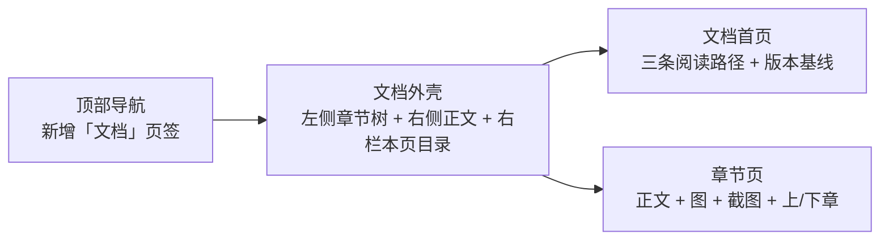

# 02 · 站点集成

规定文档模块如何并入 web-skill-site。**先读完再动代码**，站点有几个容易踩的既有事实。

> **本文只管「接进去」，不管「长什么样」。**
> 排版尺度、颜色分层、容器与代码块规格见
> [04-design-system.md](04-design-system.md)——那份规范移植自 VitePress 默认主题，
> 数值都是从其源码取的，**不要自己拍脑袋定字号和宽度**。
> 两份文件的分工：本文定结构与路由，04 定视觉。

---

## 1. 站点现状（集成前提，已实测）

| 事实                   | 值                                                                                                                                             | 影响                             |
| ---------------------- | ---------------------------------------------------------------------------------------------------------------------------------------------- | -------------------------------- |
| 页面切换机制           | `src/App.tsx` 里 `useState('home')` + `switch`，**没有路由库**                                                                                 | 文档 33 章必须能深链，需自建路由 |
| 导航项                 | `home` / `implement` / `standards` 三个                                                                                                        | 新增第四个 `docs`                |
| i18n                   | `react-i18next` + `src/locales/{en,zh}.json`（198 键）                                                                                         | 文案必须双语入表                 |
| 主题                   | **固定暗色**，`--color-bg: #000000`，**无亮色模式**                                                                                            | 不写主题切换，不写死颜色         |
| 语义 token             | `--color-bg` `--color-surface` `--color-surface-hover` `--color-accent`(#38bdf8) `--color-text-main` `--color-text-dim` `--color-border-color` | 只能用这些                       |
| 已有 Markdown 渲染依赖 | `react-markdown`、`react-syntax-highlighter`                                                                                                   | **不需要新增**渲染依赖           |
| Mermaid 依赖           | **没有**                                                                                                                                       | 图需预渲染为 SVG，见 §5          |
| 构建入口               | `index.html`（站点）、`demo.html`（Demo）、`viewer.html`（投放）                                                                               | 文档并入 `index.html`            |
| 校验命令               | `pnpm lint`（tsc --noEmit）、`pnpm build`                                                                                                      | 交付前必须双绿                   |

> 站点用 `motion`、`lucide-react`、已有 `FadeIn` 组件，
> 文档模块的动效与图标沿用它们，不要引入新的动效/图标库。

---

## 2. 内容存放结构

```
src/docs/
├── manifest.ts              章节清单（唯一真相：顺序、slug、标题、所属部分）
├── zh/
│   ├── 01-intro.md
│   ├── 02-editions.md
│   └── …（33 篇）
└── en/
    ├── 01-intro.md
    └── …（33 篇，与 zh 一一对应）

public/docs-assets/
├── <slug>/                  按章分目录
│   ├── xxx.png              截图
│   └── xxx.svg              预渲染的 Mermaid 图
```

约束：

- `zh/` 与 `en/` **文件名必须一一对应**，缺一即构建失败（在 manifest 里做校验）。
- Markdown 用 Vite 的 `import.meta.glob('./zh/*.md', { query: '?raw', eager: true })`
  批量导入，不要一篇篇手写 import。
- `manifest.ts` 是章节顺序的唯一真相，侧栏、上一章/下一章、搜索索引全部从它派生
  （与 SDK 里 `CONSOLE_NAV` 是同一种设计思路，照抄这个模式）。

---

## 3. 路由

文档有 33 章，**必须支持深链**：交叉引用、外部分享、从 chatbot 的帮助入口跳转都依赖它。

推荐 **hash 路由**，理由：站点当前无路由库，hash 路由零依赖、
不需要服务端 rewrite 配置（站点是纯静态托管）。

| URL                                  | 含义                     |
| ------------------------------------ | ------------------------ |
| `#/docs`                             | 文档首页（三条阅读路径） |
| `#/docs/chat-basics`                 | 第 5 章                  |
| `#/docs/chat-basics#stop-generation` | 章内锚点                 |

实施要点：

1. `App.tsx` 的 `activeTab` 改为从 `location.hash` 派生，并监听 `hashchange`。
   保持 `home`/`implement`/`standards` 的现有行为不回归（它们可继续无 hash 显示为默认）。
2. 未知 slug 回落到文档首页，**不要白屏**。
3. 切章后滚动到顶部；带锚点时滚动到锚点。
4. `document.title` 随章节更新（`App.tsx` 已有 title 更新逻辑，扩展它，
   注意它现在依赖 `i18n.resolvedLanguage` 判断中英，沿用同一套判断）。

---

## 4. 双语

**这是硬约束，不是可选项。**

- 章节正文：`src/docs/zh/*.md` 与 `src/docs/en/*.md` 各一份。
- 界面文案（侧栏标题、上一章/下一章、搜索框、目录、版本声明等）：
  写入 `src/locales/{zh,en}.json`，新增顶层键 `docs`，与既有 `nav`/`hero` 等并列。
- 语言切换后**当前章节不能丢**：切 `zh`→`en` 应停留在同一 slug 的英文版。
  这是最容易漏的回归点，验收清单里有对应项。
- 章节标题同时出现在 `manifest.ts` 与 md 正文首行 `#` 时，
  以 manifest 为准渲染侧栏，正文标题保持一致，避免两处不同步。

---

## 5. Mermaid 图的交付方式

站点**没有** mermaid 依赖，且运行时引入 mermaid 会显著增加首屏体积。

**推荐：编写期预渲染为 SVG，提交产物。**

|          | 预渲染 SVG（推荐）   | 运行时渲染     |
| -------- | -------------------- | -------------- |
| 体积     | 每图几 KB            | +数百 KB 依赖  |
| 暗色适配 | 生成时固定，可控     | 需运行时配主题 |
| 可维护性 | 需保留 `.mmd` 源文件 | 改图即改文     |

执行要求：

1. Mermaid 源码保存在 `docs-authoring/.work/diagrams/<图号>.mmd`，
   **必须随 SVG 一起保留**，否则后续无法修改。
2. 渲染时使用**暗色主题**并对齐站点配色：背景透明、主色 `#38bdf8`、
   文字 `#FAFAFA`、次要文字 `#A1A1AA`、边框 `rgba(255,255,255,0.15)`。
   生成后在站点里肉眼确认：**不能出现白底方块**。
3. SVG 放 `public/docs-assets/<slug>/`，在 Markdown 里用 `` 引用。
4. 图必须有文字替代说明（`alt` + 图注），不能只有图。

> 若最终决定运行时渲染 mermaid，必须在 PR 里说明体积影响，
> 并确认暗色主题下无白底——这是本站点唯一的主题，出问题非常显眼。

---

## 6. 页面组成

文档模块至少包含三类界面：



| 区域         | 要求                                                               |
| ------------ | ------------------------------------------------------------------ |
| 左侧章节树   | 按 6 个部分分组，当前章高亮；窄屏折叠为抽屉                        |
| 正文区       | **列宽 `43rem`**，见 [04-design-system.md](04-design-system.md) §2 |
| 右侧本页目录 | 由 `##` 标题生成，滚动高亮；窄屏隐藏                               |
| 上/下章      | 每章底部，取自 manifest 顺序                                       |
| 截图         | 统一的图 + 说明组件，见 04 §5；可点击放大（用站点已有的 `motion`） |

> **正文宽度不要写成「撑满」或「72 字符」这类近似值。**
> 取 04 规范里的 `43rem`——它对应一行约 40 个汉字，
> 是这套排版读起来舒服的主要原因，改宽了就白抄了。

响应式：站点现有页面已适配窄屏，文档模块必须同等适配。
**在 375px 宽度下检查一遍**，别让代码块和表格撑破布局。
代码块在窄屏下的处理见 04 §4（取消圆角、左右出血占满宽度）。

---

## 7. 与 Demo 的互链

文档以 Demo 为例，二者要能互相到达：

- 文档章节里凡是「你可以在 Demo 里试」的地方，给一个跳转到 `/demo` 的链接；
  若能带上目标屏（Demo 的 `Screen` 有 7 个值），直接落到对应屏更好。
- Demo 侧可考虑在助手界面或技能中心加一个「查看文档」入口指回 `#/docs`。
  这一项是**可选增强**，不做也不算缺陷。

---

## 8. 集成完成的判据

全部满足才算集成完成：

1. `pnpm lint` 通过（`tsc --noEmit` 零错）。
2. `pnpm build` 通过。
3. 顶部导航出现「文档 / Docs」页签，中英文都正确。
4. 33 章全部可访问，无 404、无白屏。
5. 深链可用：直接打开 `#/docs/<任一 slug>` 能正确落到该章。
6. 切换语言后停留在同一章，内容随之切换。
7. 375px 宽度下无横向滚动、无溢出。
8. 全站无写死颜色（检查新增代码里不含 `#fff`、`bg-white`、`text-gray-*` 等）。
9. 所有图片资源存在，无碎图。
10. 暗色下所有 Mermaid SVG 无白底。
11. **视觉规范的验收项全部通过**，见
    [04-design-system.md](04-design-system.md) §8——
    尤其是正文列宽、h2 分隔线、中文行首标点、容器语义配色四项。
