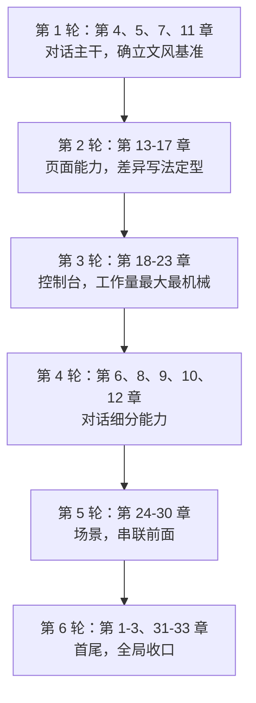

# 00 · 章节索引与配额

逐章编写指导的入口。每章的详细指导在本目录的分部文件里。

| 部分          | 章    | 指导文件                                                   |
| ------------- | ----- | ---------------------------------------------------------- |
| 一 · 开始使用 | 1-3   | [01-part1-getting-started.md](01-part1-getting-started.md) |
| 二 · 对话     | 4-12  | [02-part2-chat.md](02-part2-chat.md)                       |
| 三 · 页面能力 | 13-17 | [03-part3-page-powers.md](03-part3-page-powers.md)         |
| 四 · 控制台   | 18-23 | [04-part4-console.md](04-part4-console.md)                 |
| 五 · 场景实战 | 24-30 | [05-part5-scenarios.md](05-part5-scenarios.md)             |
| 六 · 参考     | 31-33 | [06-part6-reference.md](06-part6-reference.md)             |

---

## 1. 每章指导的固定结构

分部文件里，每章都按这六项给出，缺项即为手册缺陷：

| 项       | 含义                                 |
| -------- | ------------------------------------ |
| **目标** | 读者读完能做到什么（一句话，可检验） |
| **大纲** | 小节列表，含三个强制小节             |
| **取材** | 具体到文件的取材指引，标注优先级     |
| **图**   | 该章要画的 Mermaid 图编号与类型      |
| **截图** | 该章的截图编号、场景与标注要点       |
| **判据** | 什么算写完了                         |

---

## 2. 图与截图的配额

| 部分     | 章数   | Mermaid 图 | 编号        | 截图（P0） |
| -------- | ------ | ---------- | ----------- | ---------- |
| 一       | 3      | 3          | M-01 ~ M-03 | 10         |
| 二       | 9      | 10         | M-04 ~ M-13 | 61         |
| 三       | 5      | 5          | M-14 ~ M-18 | 29         |
| 四       | 6      | 6          | M-19 ~ M-24 | 45         |
| 五       | 7      | 6          | M-25 ~ M-30 | 40         |
| 六       | 3      | 3          | M-31 ~ M-33 | 7          |
| **合计** | **33** | **33**     |             | **192**    |

第 11 章有两张图（M-11、M-12），第 25 章复用 M-14 不新增，故二、五两部分图数与章数不等。

> **第五部分从 5 章扩到 7 章**：新增第 28 章（说一句话替你填表）、
> 第 29 章（把文档内容录进系统），原第 28 章扩写为第 30 章（技能的一生）。
> 第六部分顺延为第 31-33 章。理由见
> [05-part5-scenarios.md](05-part5-scenarios.md) 开头。

截图数为**中文版**数量，英文版另需一套（无文字图可共用），
实际拍摄量约 250-290 张。逐章编号以各部分指导文件为准。

配额是**下限参考**，不是硬指标。原则：

- 每个功能小节至少 1 张截图。**没有截图的功能描述不可信。**
- 每章 Mermaid 图 0-2 张。图是用来讲清「流程 / 关系 / 状态」的，
  能用一句话说清的事**不要画图**。
- console 章按页配图：25 个页面各至少 1 张，构成第四部分的 25 张主截图。

图的完整清单见 [../03-visuals/01-mermaid-catalog.md](../03-visuals/01-mermaid-catalog.md)，
截图清单见 [../03-visuals/03-shotlist.md](../03-visuals/03-shotlist.md)。

---

## 3. 建议的写作顺序

**不要按章号顺序写。** 推荐顺序：

理由：

- **第 4、5、7、11 章先写**：它们是全书文风与术语的基准，写完先做一次审稿，
  确认视角没跑偏，再批量推进。跑偏了只需返工 4 章而不是 33 章。
- **第 1-3 章最后写**：入门章要提炼全书精华，写完全书才知道该提炼什么。
- **第 31-33 章最后写**：对照表、排错、隐私都是全书内容的汇总，
  必须等素材齐了才写得准。

---

## 4. 每章开工前的检查

动笔前逐项确认，任何一项没做就写，返工概率极高：

1. 读完该章「取材」里标注为 P0 的全部材料。
2. 在 Demo（和扩展，若涉及）里把该章功能**实际操作一遍**。
3. 导出该章涉及的 i18n 文案域，确认界面措辞。
4. 确认 `docs/deferred-items.md` 里没有该章要写的能力。
5. 在 `.work/feature-inventory.md` 里把该章覆盖的条目标为「写作中」。

---

## 5. 交付物

每章交付：

- `src/docs/zh/<NN>-<slug>.md`
- `src/docs/en/<NN>-<slug>.md`
- `public/docs-assets/<slug>/` 下的截图与 SVG
- `docs-authoring/.work/diagrams/<图号>.mmd`（Mermaid 源码，必须保留）
- `.work/feature-inventory.md` 中该章条目状态更新为「已审」
