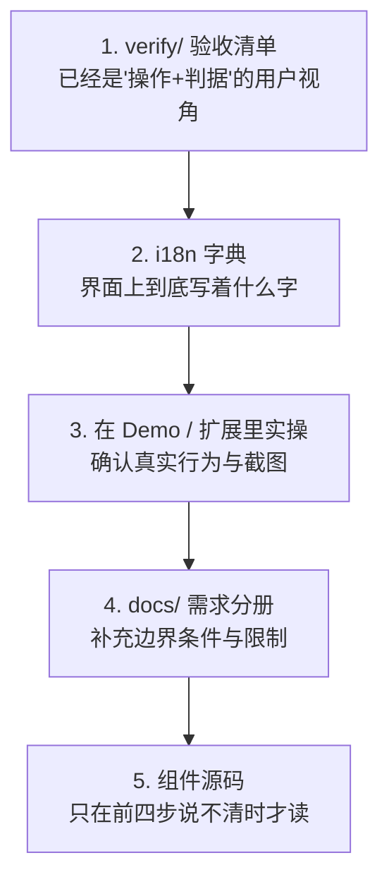

# 01 · 源码地图

「这个功能该去哪儿查」的总索引。所有路径都已实测存在。
路径前缀含义见 [../README.md](../README.md) §6。

---

## 1. 取材的优先级

按这个顺序找，**不要一上来就读组件源码**——那是最慢也最容易读出开发者视角的路:

理由：前三步产出的内容天然就是用户视角；第 5 步产出的内容天然是开发者视角，
读多了会污染文风。

---

## 2. 最高价值素材：`verify/`

SDK 仓库的 `verify/` 是人工验收清单，每条形如「**操作**：… **通过判据**：…」，
本质上就是一份行为说明书。**这是本次文档的第一取材源。**

### `verify/agent/`（30 份，自动化可覆盖的面）

| 文件                             | 覆盖内容                           | 供给文档章节         |
| -------------------------------- | ---------------------------------- | -------------------- |
| `00-overview.md`                 | 全局导览、环境要求                 | 3                    |
| `01-environment.md`              | 运行环境前提                       | 3、29                |
| `02-chat-basics.md`              | 发送、流式、停止、Markdown、代码块 | **5**                |
| `03-message-fidelity.md`         | 消息保真、中止后正文保留           | 5                    |
| `04-skills.md`                   | 技能触发、选择、执行               | **7**                |
| `05-interactions.md`             | 六种交互卡                         | **8**                |
| `06-generative-ui.md`            | 表单/表格/图表渲染                 | **9**                |
| `07-attachments.md`              | 附件上传与处理                     | **10**               |
| `08-page-perception.md`          | 页面感知范围与排除                 | **13**               |
| `09-page-actions.md`             | 页面操作与授权                     | **14**               |
| `10-models.md`                   | 模型切换与能力                     | **12**               |
| `11-runtime-limits.md`           | 步数/时长限制                      | 22（运行时设置）、29 |
| `12-sessions-memory.md`          | 会话与记忆                         | **6**                |
| `13-privacy-profile.md`          | 隐私档位                           | 22、**30**           |
| `14-mcp-endpoints.md`            | MCP 端点、工具启停                 | **21**               |
| `15-sandbox-security.md`         | 沙箱边界                           | 22、30               |
| `16-install-trust.md`            | 技能安装与信任                     | **18**、22           |
| `17-console-skills.md`           | 控制台技能页                       | **18**               |
| `18-console-runs.md`             | 运行记录页                         | **19**               |
| `19-governance-review.md`        | 复核队列                           | **20**               |
| `20-governance-audit.md`         | 审计日志                           | 20                   |
| `21-governance-versions.md`      | 版本管理                           | 20                   |
| `22-governance-eval-insights.md` | 评测与洞察                         | 20                   |
| `23-console-connections.md`      | 连接组 4 页                        | **21**               |
| `24-console-settings.md`         | 设置组 8 页                        | **22**               |
| `25-theme-visual.md`             | 主题与视觉                         | 22（外观）           |
| `26-console-shell.md`            | 控制台外壳、导航、命令面板         | **17**               |
| `27-linked-documents.md`         | 关联文档                           | **16**               |
| `28-catalog-visuals.md`          | 目录视觉                           | 9、18                |
| `29-container-layout.md`         | 容器布局、响应式                   | 4、22                |

### `verify/human/`（13 份，必须真人操作的面）

**这 13 份尤其重要**——需要真人验证的，往往正是用户最能感知的能力。

| 文件                              | 覆盖内容               | 供给章节   |
| --------------------------------- | ---------------------- | ---------- |
| `01-voice-dictation.md`           | 语音听写               | **10**     |
| `02-chrome-builtin-ai.md`         | 浏览器内置 AI          | **12**     |
| `03-webmcp-host-page.md`          | 页面自带工具（WebMCP） | **21**     |
| `04-downloads-filesystem.md`      | 下载与文件系统         | **16**     |
| `05-persistence.md`               | 刷新后不丢             | 6          |
| `06-appearance-responsive.md`     | 外观与响应式           | 22         |
| `07-network-resilience.md`        | 断网恢复               | **29**     |
| `08-accessibility-concurrency.md` | 无障碍与并发           | 4、29      |
| `09-oauth-page-actions.md`        | 登录态下的页面操作     | **14**     |
| `10-document-print.md`            | 文档与打印             | **16**、25 |
| `11-real-model-behavior.md`       | 真实模型行为差异       | 12、29     |
| `12-camera-capture.md`            | 摄像头拍照             | **10**     |

另有 `verify/AC-COVERAGE.md`（验收覆盖矩阵）、`verify/case-registry.json`
（用例注册表）可用于核对是否漏掉了某个能力面。

> **转写纪律**：verify 是写给验证者的，语气是「应当…否则不通过」；
> 文档是写给用户的，语气是「你会看到…」。**改写文风，不要直接复制**。
> 另外 verify 里含大量 DevTools 断言片段（如 `__verifyVisual.codeTokenColors()`），
> 这些**一律不进用户文档**。

---

## 3. 界面文案：i18n 字典

| 面                 | 文件                                                           | 规模                 |
| ------------------ | -------------------------------------------------------------- | -------------------- |
| chatbot            | `packages/chatbot/src/i18n.ts`                                 | 377 条 × 中英        |
| console 页面元信息 | console i18n 的 `page.<id>.label` / `.purpose` / `.capability` | 25 页 × 3            |
| 扩展专属           | `examples/browser-extension/src/**`                            | 侧栏、选项页、沙箱页 |

console 的 `purpose` 和 `capability` 是**现成的页面简介**，
改成用户口吻后可直接用于第 19-23 章每个小节的开头。

抽取命令见 [02-extraction-recipes.md](02-extraction-recipes.md)。

---

## 4. 按能力查源码

只在前面几步说不清楚时才用。

### chatbot 界面

| 能力                               | 源码                                                                                                                  |
| ---------------------------------- | --------------------------------------------------------------------------------------------------------------------- |
| 整体外壳、头部                     | `packages/chatbot/src/react/Chatbot.tsx`、`AssistantUiShell.tsx`                                                      |
| 输入框（附件/语音/拍照/发送/停止） | `packages/chatbot/src/react/Composer.tsx`                                                                             |
| 消息渲染与操作栏                   | `AssistantUiMessage.tsx`、`WebSkillMessageExtensions.tsx`、`MessageDeleteOutlet.tsx`                                  |
| 六种交互卡                         | `InteractionCard.tsx`、`SpecInteraction.tsx`、`SubmittedInteraction.tsx`、`InteractionWaitBar.tsx`                    |
| 生成式界面（三种渲染档）           | `SurfaceByRenderer.tsx`、`A2uiSurfaceHost.tsx`、`OpenUiSurfaceHost.tsx`、`VercelSurfaceHost.tsx`、`InlineSurface.tsx` |
| 结果与产物                         | `ResultBlocksPro.tsx`                                                                                                 |
| 任务清单                           | `TodoPanel.tsx`                                                                                                       |
| 技能标记                           | `SkillBadges.tsx`                                                                                                     |
| 页面感知提示                       | `aui/PerceptionNotice.tsx`                                                                                            |
| 中断提示                           | `InterruptedBanner.tsx`                                                                                               |
| 错误卡                             | `ErrorCard.tsx`                                                                                                       |
| 拍照                               | `CameraCaptureDialog.tsx`                                                                                             |
| 附件小片                           | `UserAttachmentChips.tsx`                                                                                             |
| 特性区块文案底座                   | `ChatbotSurfaceTexts.tsx`                                                                                             |

### console 页面

`packages/console/src/react/pages/` 下 29 个 `.tsx`，与 25 个页面对应
（多出的是子组件：`LlmUsageSection.tsx`、`TemporarySkillDetailDialog.tsx`、
`CandidateSources.tsx`、`SkillUsageChart.tsx`、`controls.tsx`）。
导航真相在 `packages/console/src/react/nav.ts`。

### 运行与限制

| 能力           | 源码                                                             |
| -------------- | ---------------------------------------------------------------- |
| 对话循环、步进 | `packages/runtime/src/engine/agentLoop.ts`                       |
| 步数/时长限制  | `packages/runtime/src/engine/limits.ts`（`DEFAULT_LOOP_LIMITS`） |

限制的**默认值**要写进文档（用户会问「为什么停了」），从这里取实数。

### 页面能力

| 能力                   | 源码                                                                                |
| ---------------------- | ----------------------------------------------------------------------------------- |
| 页面感知提示词与范围   | `packages/agent/src/prompts/perception.ts`                                          |
| 页面操作工具与策略     | `packages/agent/src/pageAction/toolSource.ts`、`policy.ts`、`prompts/pageAction.ts` |
| 标签页工作集（扩展版） | `packages/agent/src/tabs/toolSource.ts`、`policy.ts`、`prompts/tabWorkset.ts`       |
| DOM 读取与截图         | `packages/browser/src/dom/`                                                         |

`policy.ts` 里定义了**什么会被拒绝**，是写「安全边界」小节的关键素材
（对应界面上的「被策略拒绝」状态）。

### 扩展版

| 面                        | 源码                                       |
| ------------------------- | ------------------------------------------ |
| 权限声明                  | `examples/browser-extension/manifest.json` |
| 侧栏助手                  | `src/sidepanel/`                           |
| 选项页（console）         | `src/options/`                             |
| 内容脚本（页面感知/操作） | `src/content/`                             |
| 后台服务                  | `src/background/`                          |
| 沙箱执行                  | `src/sandbox/`                             |
| 投放查看器                | `src/viewer/`                              |
| 摄像头 / 麦克风           | `src/camera/`、`src/microphone/`           |

### 生成式界面底层

`packages/ui/src/` —— 目录、表单模型、渲染档预设。
只在解释「为什么某些字段只显示第一项」这类现象时才需要查
（对应文案 `surface.arrayFirstItemOnly`）。

---

## 5. Demo 素材

| 素材             | 位置                                | 数量                                                             |
| ---------------- | ----------------------------------- | ---------------------------------------------------------------- |
| 屏幕             | `src/demo/types.ts` 的 `Screen`     | 7                                                                |
| 页面工具         | `src/demo/webskill/pageSkills.ts`   | 8                                                                |
| 页面技能（按屏） | 同上                                | 按 7 屏分组                                                      |
| 内置技能         | `public/skills/builtin/`            | 13                                                               |
| 快捷提示         | `src/demo/webskill/quickPrompts.ts` | 中英各若干                                                       |
| 界面组件         | `src/demo/components/`              | ChatDrawer / Screens / Sidebar / SkillCenterScreen / LoginScreen |

8 个页面工具（`list_projects` `list_requirements` `list_sprints` `list_bugs`
`list_test_suites` `get_dora_metrics` `get_field_history` `navigate_to_screen`）
是讲「工具」概念的最佳实例——它们名字自解释，且能在运行步进里看到被调用。

13 个内置技能覆盖了报告、大屏、公文、幻灯片、图片分析等不同产物形态，
是第五部分场景章的素材库。

---

## 6. 需求分册（补充边界）

SDK 仓库 `docs/` 下按版本组织的需求/设计分册。
**只取「验收标准」段落里描述用户可见行为的部分**，其余不取。

有用的切入点：

- `docs/deferred-items.md` —— 明确列出**尚未实现**的能力。
  写作前扫一遍，避免写了不存在的功能。
- `docs/overall-requirements.md` —— 产品整体定位，写第 1 章时可参考其价值主张，
  但要改写成用户语言。
- `docs/0.1x.0-requirements.md` 系列 —— 近期版本新增的用户可见能力。
