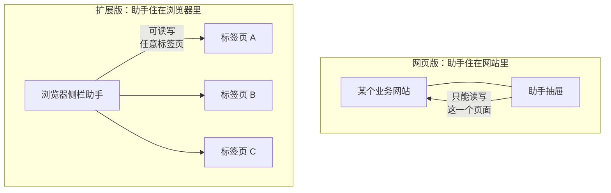

# 03 · 网页版与扩展版的差异取证

全书**铁律二**：不能只写网页版。这一节给出判定差异的方法与已确认的事实清单。

---

## 1. 两种形态的本质区别

用一句用户能懂的话说清：

> **网页版**是嵌在某个网站里的助手，它的视野和手脚都局限在那一个网站里。
> **扩展版**装在浏览器上，它能看到和操作你打开的任意网页，还能跨多个标签页干活。

这个区别派生出后面所有差异。文档第 2 章要用一张图讲清楚：



---

## 2. 已确认的差异事实

来源：`examples/browser-extension/manifest.json` 的权限声明
与 `e2e-extension/*.spec.ts` 的验收用例。这些是**扩展版实际具备**的能力。

| 能力                 | 网页版                                                                      | 扩展版                                                    | 取证                                                                        |
| -------------------- | --------------------------------------------------------------------------- | --------------------------------------------------------- | --------------------------------------------------------------------------- |
| 读当前页面           | 支持（仅自身所在页）                                                        | 支持（任意网页）                                          | `<all_urls>` + `scripting`                                                  |
| 读跨源嵌套帧         | 受限                                                                        | 支持（三层嵌套的最内层跨源帧文本与图像都能进上下文）      | `nestedFrameImages.spec.ts` AC-16.1 / 16.16                                 |
| 操作页面             | 支持（仅自身所在页）                                                        | 支持（任意网页）                                          | `scripting`                                                                 |
| 跨标签页工作         | **不支持**                                                                  | 支持（工作集）                                            | `tabWorkset.spec.ts`、`packages/agent/src/tabs/`                            |
| 跟随活动标签页       | 不适用                                                                      | 切换标签页后绑定自动跟过去，但扩展自己的页面不接管        | AC-14.6                                                                     |
| 枚举用户自开的标签页 | 不适用                                                                      | **不能**——工作集外的句柄一律结构化拒绝                    | AC-G4                                                                       |
| 抢占你的画面         | 不适用                                                                      | **不会**——切焦点不动用户画面，一轮后焦点原样              | AC-G5                                                                       |
| 逐项处理一个列表     | **受限但可用**——同站内靠「跳转 + 后退」往返，做不到跨标签页/跨站点/多页并留 | 支持（进详情、读完、回列表、进下一项，中途无需用户操作）  | AC-G10、`docs/0.16.0/13-req-action-destination-signal.md`                   |
| 逐项处理的层数       | 同上（受同站导航限制）                                                      | 至少三层下钻与逐层回退                                    | FR-16.6                                                                     |
| 一轮最多同时开多少页 | 不适用                                                                      | 32（可调范围 2 ~ 32），撞上限后中途收尾且无法向用户要配额 | `TAB_WORKSET_DEFAULT_MAX`、`docs/0.17.0/18-req-workset-capacity-default.md` |
| 下载文件             | 受浏览器常规限制                                                            | 支持，且能感知下载是否真的发生                            | `downloads` 权限、AC-15.9                                                   |
| 下载授权的记住/撤销  | 不适用                                                                      | 支持，可在 console 里查看并撤销                           | AC-20.14                                                                    |
| 密码框内容           | 不外发                                                                      | **不外发，且永不记住**                                    | AC-14.8、AC-14.11                                                           |
| 技能脚本执行环境     | 浏览器内沙箱                                                                | 独立 sandbox 页                                           | `sandbox.pages`、AC-14.4 / 12.7                                             |
| 发现页面自带的工具   | 由所在网站提供                                                              | 页面一行不改也能发现其端点、页面技能与 WebMCP 工具        | AC-18.9                                                                     |
| 换页后清理           | 不适用                                                                      | 换到另一页后上一页的端点一个都不剩                        | AC-18.5                                                                     |
| 嵌入帧里的端点       | 不适用                                                                      | **不接管**                                                | AC-18.11                                                                    |
| 打开 console         | 网站内的技能中心                                                            | 扩展选项页，且支持带分区深链                              | `options/`，「打开设置时带上分区」                                          |
| 文档投放/放映        | 新窗口                                                                      | `view.html`，需确认卡同意后才开窗                         | AC-13.14 / 13.4                                                             |

> 这张表是第 31 章的底稿，但**不要直接把 AC 编号写进用户文档**。
> AC 编号是给验证者的，用户看不懂。取证列只服务于写作者。

---

## 3. 差异的三种写法

不同差异用不同方式呈现，别一律堆表格：

| 差异类型 | 写法                      | 例子                |
| -------- | ------------------------- | ------------------- |
| 能力有无 | 提示块 `> **仅扩展版**：` | 跨标签页工作        |
| 程度不同 | 章内小表格对比两列        | 页面感知的范围      |
| 入口不同 | 分别给两套操作步骤        | 打开 console 的方式 |

**入口不同**是最常被写漏的：同一个功能在两种形态里可能点法完全不同，
只写一套步骤会让另一半读者卡住。

---

## 4. 取证方法

写每一章的差异小节时，按顺序做：

1. **查权限**：这个能力依赖哪个扩展权限？（§2 表的取证列）
   网页版没有该权限对应的能力 → 差异成立。
2. **查 e2e 用例**：`e2e-extension/` 里有没有对应用例？
   有 → 扩展版确实具备，用例描述就是行为事实。
3. **实操验证**：在 Demo（网页版）与已加载的扩展里各做一遍，看现象是否真的不同。
4. **写不确定就别写**：三步都无法确认的差异，写「以你所用形态的实际界面为准」，
   **不要猜**。

```bash
# 第 2 步的检索命令
cd ~/Git/web-skill-sdk && ls e2e-extension/
cd ~/Git/web-skill-sdk && grep -rhoE "test\('[^']{4,70}'" e2e-extension/*.spec.ts | sed "s/test('//;s/'\$//"
```

---

## 5. 安全边界必须一并写清

扩展版权限大（`<all_urls>`），用户天然会警惕。
**每一处讲扩展版更强能力的地方，都要在同一屏内给出对应的约束**，否则文档会显得可怕：

| 能力           | 必须同时说明的约束                                 |
| -------------- | -------------------------------------------------- |
| 能读任意网页   | 密码框的值不会被读取，也永远不会被记住             |
| 能操作任意网页 | 有副作用的操作要经过你授权；可以撤销               |
| 能跨标签页     | 只能用工作集里的标签页，你自己开的标签页它枚举不到 |
| 能切换标签页   | 不会抢走你的画面，一轮结束后焦点回到原处           |
| 能下载         | 下载授权可在 console 里查看并撤销                  |
| 能发现页面工具 | 换页后上一页的端点会被清掉；嵌入帧里的端点不接管   |

这张表同时也是第 33 章（隐私与数据去向）的骨架。

---

## 6. 常见误写

| 误写                                | 事实                                                                                              |
| ----------------------------------- | ------------------------------------------------------------------------------------------------- |
| 「扩展版能看到你所有的标签页」      | 只能看工作集内的；用户自开的标签页枚举不到（AC-G4）                                               |
| 「助手会自动跳到别的标签页」        | 不动用户画面，一轮后焦点原样（AC-G5）                                                             |
| 「网页版也能跨页汇总」              | 不能，这是扩展版独有                                                                              |
| **「逐项处理列表是扩展版独有」**    | **错**。网页版在同一站点内靠「跳转 + 后退」也能逐项往返；扩展版独有的是跨标签页、跨站点、多页并留 |
| **「它能一直处理下去」**            | 一轮最多同时开 32 页，撞上限会中途收尾，且它无法向你要更多配额                                    |
| 「授权一次就永久生效」              | 可撤销；密码框永不记住                                                                            |
| 「两种形态的 console 一样」         | 入口不同（网站内技能中心 vs 扩展选项页），扩展选项页支持分区深链                                  |
| 「扩展会接管页面里嵌的所有 iframe」 | 嵌入帧里注册的端点不接管（AC-18.11）                                                              |
