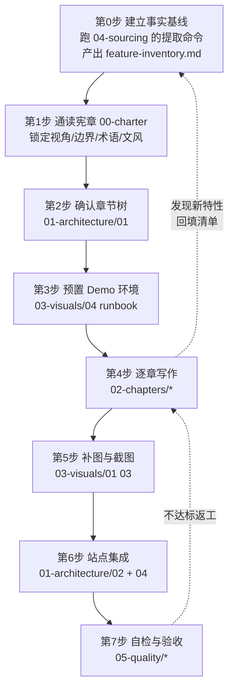

# 文档模块编写指导手册

本目录是**指导手册**，不是文档本身。它规定 web-skill-site 站点内「文档模块」
（面向使用者的 chatbot / console 使用指南）该怎么写、写什么、从哪里取材、
配哪些图和截图。执行者按本手册产出实际文档内容。

**本目录的产物 ≠ 文档模块的产物。** 不要在本目录里写正式文档正文。

---

## 1. 一句话定义任务

> 为 web-skill-site 增加一个文档模块，系统性讲清楚**用户**如何操作 WebSkill 的
> chatbot 与 console，覆盖网页版与扩展版两种形态的差异，全程以本站的 Demo
> （`/demo`，Agile Studio）为实例，配以 Demo 截图。

四个限定词，任何一条被违反都算返工：

| 限定词        | 含义                               | 反例（禁止）                          |
| ------------- | ---------------------------------- | ------------------------------------- |
| **用户视角**  | 讲"你怎么用"，不讲"怎么接入"       | "调用 `createChatbot()` 传入 runtime" |
| **系统性**    | 覆盖全部用户可见能力，不是精选亮点 | 只写 5 个常用功能就收尾               |
| **两种形态**  | 网页版与扩展版逐项标注差异         | 通篇不区分，读者装了扩展发现对不上    |
| **Demo 实证** | 每个功能都能在 `/demo` 里复现      | 用虚构的界面/数据举例                 |

SDK 接入、API、架构实现**不在本次范围**，见
[00-charter/02-scope-boundaries.md](00-charter/02-scope-boundaries.md)。

---

## 2. 手册的组织

```
docs-authoring/
├── README.md                  ← 你在这里：总纲与执行顺序
├── 00-charter/                宪章：读者、边界、术语、文风（先读，全程约束）
│   ├── 01-audience-and-voice.md
│   ├── 02-scope-boundaries.md
│   ├── 03-terminology.md
│   └── 04-writing-rules.md
├── 01-architecture/           架构：文档章节树与站点集成方式
│   ├── 01-information-architecture.md   ★ 完整章节树（文档的目录设计）
│   ├── 02-site-integration.md           ★ 怎么并入 web-skill-site
│   ├── 03-page-templates.md             每类页面的骨架模板
│   └── 04-design-system.md              ★ 视觉规范（移植自 VitePress 默认主题）
├── 02-chapters/               逐章编写指导（内容 / 取材 / 图 / 截图 / 判据）
│   ├── 00-index.md            章节清单、依赖顺序、工作量分配
│   ├── 01-part1-getting-started.md
│   ├── 02-part2-chat.md
│   ├── 03-part3-page-powers.md
│   ├── 04-part4-console.md
│   ├── 05-part5-scenarios.md
│   └── 06-part6-reference.md
├── 03-visuals/                图与截图
│   ├── 01-mermaid-catalog.md  该画哪些 Mermaid 图，逐张给要素与骨架
│   ├── 02-screenshot-spec.md  截图规范（尺寸/主题/语言/脱敏/命名）
│   ├── 03-shotlist.md         ★ 逐张截图清单（拍什么、怎么摆、标什么）
│   └── 04-capture-runbook.md  拍摄手册（Demo 预置、脚本、扩展侧拍法）
├── 04-sourcing/               取材
│   ├── 01-source-map.md       ★ 特性 → 源码位置总索引
│   ├── 02-extraction-recipes.md  从源码提取用户可见行为的具体命令
│   └── 03-web-vs-extension.md ★ 两种形态差异的取证方法
└── 05-quality/                质量
    ├── 01-review-checklist.md 审稿清单
    ├── 02-acceptance.md       交付验收标准
    └── 03-pitfalls.md         已知陷阱（含本项目特有的坑）
```

---

## 3. 执行顺序

**不要跳步。** 尤其是第 0 步——本项目的功能面比直觉大得多
（chatbot 377 条用户文案、console 25 个页面），凭印象写必定漏。



| 步  | 产物                                        | 完成判据                                                            |
| --- | ------------------------------------------- | ------------------------------------------------------------------- |
| 0   | `docs-authoring/.work/feature-inventory.md` | 列全 chatbot 文案域与 console 25 页，每项标注「写/不写/合并到哪章」 |
| 1   | 无（内化约束）                              | 能说出用户视角与开发者视角的判别标准                                |
| 2   | 确认或修订后的章节树                        | 每章都能映射到清单里的特性，无孤儿特性                              |
| 3   | 可复现的 Demo 状态                          | `/demo` 能跑通全部待截图场景                                        |
| 4   | 各章 Markdown 正文                          | 每章满足其「完成判据」                                              |
| 5   | Mermaid 图 + 截图资源                       | 与 shotlist 逐条对齐                                                |
| 6   | 站点可访问的文档模块                        | `pnpm lint && pnpm build` 通过                                      |
| 7   | 自检报告                                    | 05-quality 清单全绿                                                 |

> `.work/` 是执行期的草稿区，产出正式文档后可保留作追溯，不并入站点构建。

---

## 4. 三条铁律

写作过程中反复自问，违反即返工：

**铁律一：不能在 Demo 里复现的，不准写。**
每个功能描述都必须对应一次真实操作。写不出「在哪点、点完看到什么」，
说明你在复述源码而不是在写使用手册。取材命令见
[04-sourcing/02-extraction-recipes.md](04-sourcing/02-extraction-recipes.md)。

**铁律二：不能只写网页版。**
本项目里网页版与扩展版的差异是**能力级**的（扩展版能跨标签页、能操作任意网站、
能下载文件；网页版只能感知和操作自己所在的这一个页面）。
每章末尾必须有形态差异说明，判定方法见
[04-sourcing/03-web-vs-extension.md](04-sourcing/03-web-vs-extension.md)。

**铁律三：站点是固定暗色主题，文档模块必须双语。**
web-skill-site 目前只有暗色（`--color-bg: #000000`），没有亮色模式。
所有自绘样式只能用站点既有语义 token（`bg-bg` / `bg-surface` / `text-text-main`
/ `text-text-dim` / `border-border-color` / `text-accent`），
禁止写死颜色值；所有面向用户的文案必须同时写入
`src/locales/zh.json` 与 `src/locales/en.json`。详见
[01-architecture/02-site-integration.md](01-architecture/02-site-integration.md)。

**铁律四：排版尺度不许自己拍脑袋。**
文档模块的字号、行高、正文列宽、容器配色一律照
[01-architecture/04-design-system.md](01-architecture/04-design-system.md) 执行——
那些数值移植自 VitePress 默认主题源码，是被大量中文技术文档验证过的。
**尤其是正文列宽 `43rem` 和中日韩的 `line-break: strict`**：
前者决定长文读起来累不累，后者不加会让中文出现行首标点。
铁律三与铁律四不冲突：颜色**用站点的 token**，尺度**用这份规范**。

---

## 5. 已知的事实基线（写作时可直接引用）

这些数字是本手册编写时从源码实测得到的，用于校验覆盖度。
执行时若发现与源码不符，**以源码为准并更新此表**。

| 事实                 | 值                                                                                  | 出处                                                         |
| -------------------- | ----------------------------------------------------------------------------------- | ------------------------------------------------------------ |
| console 导航分组     | 6 组                                                                                | `packages/console/src/react/nav.ts` `CONSOLE_NAV`            |
| console 可直达页面   | 25 页（overview 1 + skills 4 + runs 3 + governance 5 + connections 4 + settings 8） | 同上 `ConsolePage` 联合类型                                  |
| console 每页自带文案 | `page.<id>.label` / `.purpose` / `.capability`                                      | 同上注释                                                     |
| chatbot 用户文案条目 | 377 条（en）                                                                        | `packages/chatbot/src/i18n.ts`                               |
| chatbot 文案域       | 26 个前缀                                                                           | 同上，`settings` 111 / `interaction` 62 / `composer` 34 最重 |
| 扩展权限             | sidePanel, storage, tabs, scripting, webNavigation, downloads                       | `examples/browser-extension/manifest.json`                   |
| 扩展宿主权限         | `<all_urls>`                                                                        | 同上                                                         |
| 扩展沙箱页           | `sandbox.html`, `view.html`                                                         | 同上 `sandbox.pages`                                         |
| 已有验收清单         | `verify/agent/` 30 份 + `verify/human/` 13 份                                       | SDK 仓库 `verify/`                                           |
| Demo 屏幕            | 7 个（overview/requirements/sprints/bugs/tests/metrics/webskill-manager）           | `src/demo/types.ts` `Screen`                                 |
| Demo 页面工具        | 8 个                                                                                | `src/demo/webskill/pageSkills.ts`                            |
| Demo 内置技能        | 13 个                                                                               | `public/skills/builtin/`                                     |
| 站点 i18n 键         | 198 条                                                                              | `src/locales/zh.json`                                        |

**最重要的一条**：SDK 仓库的 `verify/agent/`（30 份）与 `verify/human/`（13 份）
是按主题编号的**人工验收清单**，每条都写了「操作 + 通过判据」——
它本质上已经是用户视角的行为说明书，是本次文档最高价值的取材源。
用法见 [04-sourcing/01-source-map.md](04-sourcing/01-source-map.md) §2。

---

## 6. 路径约定

手册中出现的相对路径按下表解析：

| 前缀                                             | 根目录                               |
| ------------------------------------------------ | ------------------------------------ |
| `packages/…`、`examples/…`、`verify/…`、`docs/…` | `~/Git/web-skill-sdk`（SDK 仓库）    |
| `src/…`、`public/…`、`docs-authoring/…`          | `~/Git/web-skill-site`（本站点仓库） |

两个仓库是并列的兄弟目录。站点通过 `pnpm dev:sdk`
（`WEBSKILL_SRC=../web-skill-sdk`）可以直接以源码模式加载 SDK，
取材时用这个模式能保证读到的源码与看到的界面一致。
